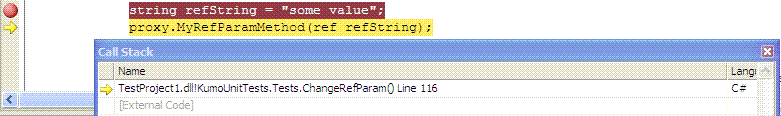
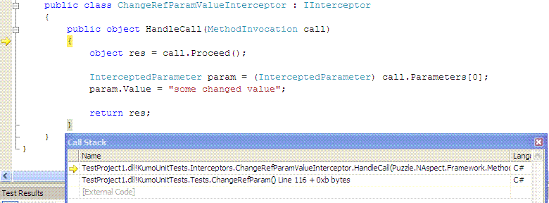
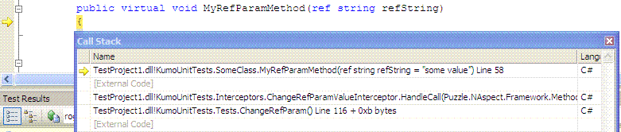
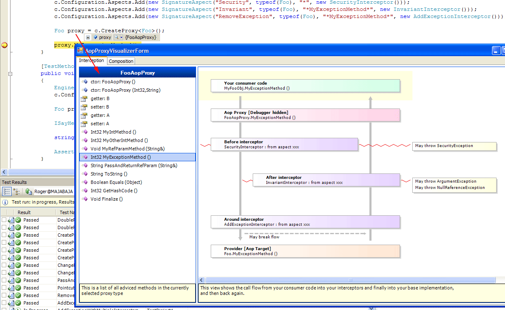

**THIS IS AN OLD POST FROM MY OLD BLOG (2006)**

<!-- truncate -->

There are quite a few AOP frameworks for .NET out there today.  
But all (?) of them suffer from the same problem, its hard or impossible to debug them.

I myself would pick debugging over AOP any day, so forcing our users to debug via coredbg or such tool was not an option when we started to build NAspect.

NAspect supports an intact callstack when stepping from your consumer code into your interceptors and finally into your real provider method.  
Here is a few screenshots:

Place a breakpoint in your consumer code:  

Single step into the method, notice how we ended up in our first interceptor instead of the provider method:  

Single step into the proceed method, now we arrive at the real provider method.  
Note that the call stack is intact and shows all steps from your consumer to your interceptor to your provier method.  

This is as far as I know not possible with any other AOP framework for .NET today.

Another problem area when dealing with AOP is to know what interceptors that actually got attached to your method.  
You can ofcourse step through the entire call flow and check the callstack, but that is pretty messy if you got a few hundred methods with a few interceptors each.

NAspect support VS.NET 2005 DebuggerVisualizers.  
Instead of trying to figure out if your config file works or single step through every method to see the interceptors, we can simply enter debug mode and visualize the AOP’ed instance:

  

On the left side of the visualizer you get a list of all adviced methods in your type,  
On the right side you get a list of interceptors for the currently selected method.

The next step will be to build a debugger visualizer that shows an UML graph of the proxied instance, showing what mixins and baseclass it relates to.

//Roger
