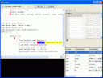

I’m still working on my Lisp language clone.  
Today I started to add debugging support to it.  
I made the AST aware of the original source code, so each node can reference back to the place it was parsed from, and I also added a bit of call stack features.

<!-- truncate -->

I’m pretty satisfied with it so far, it almost feels like a real language now 😉

Anyway, here is a screenshot of the not so well designed GUI.

   
Click for full size.

Downloads are available at: 

Source: [http://www.puzzleframework.com/roger/mylisp.zip](http://www.puzzleframework.com/roger/mylisp.zip)  
Binaries: [http://www.puzzleframework.com/roger/mylispbin.zip](http://www.puzzleframework.com/roger/mylispbin.zip)

(The code is written in C#3, VS.NET 2008 solution)
