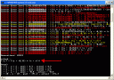
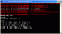
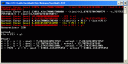
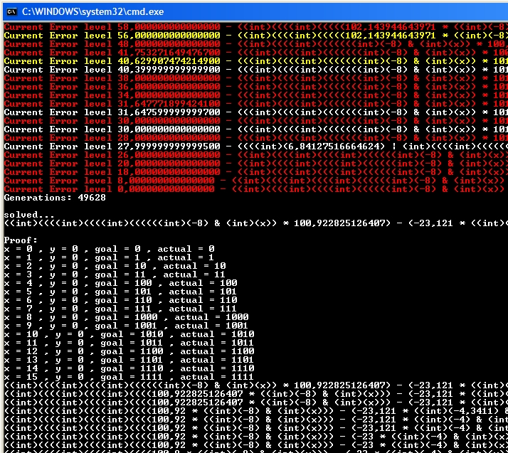

For those of you who are interested in evolution / GP.  
Here is a small app that I made to reverse engineer blackboxed formulas.

<!-- truncate -->

The application is fed with a “problem domain”

The problem domain consists of multiple cases, like this:

Case1:  
**When X is 1 and Y is 2 I want the result to be 3  **
Case2:  
**When X is 3 and Y is 5 I want the result to be 8  **
Case3:  
**When X is 10 and Y is 10 I want the result to be 20**

That was a very simple problem.  
And the formula to solve the problem would be **(X+Y).**

Ofcourse the problems aren’t described in english, it’s code. but this is the idea behind it anyway.

Once the application is fed with a problem domain, it will create a population of “formulas”  
Each formula have its own DNA, the DNA in this case is the various functions, constants and variables.

Each formula in the population will be fed with the data from each problem case and then evaluated.  
Depending on how close to the goal the result is, the better the error level is.

Once each problem case have been evaluated by a formula, all the error levels per case will be summed up.  
The summed error level is then used to decide what formulas are allowed to survive and breed.  
(There is also a bit of crossover going on between formulas, but I won’t get into that now.)

So how fancy stuff can this application solve?

Well, here are some examples:  
Problem data and result is shown on the pictures.

And no, it does not care if the result is pretty, it just strives to find a working formula.  
ofcourse this could be altered so that once the solution is found, it continues to evolve and promote shorter formulas.

**Complex solution, the application generated a formula to convert decimal 0-15 into binary representation:**

After some optimization of the final formula it came up with this:

    ((((int)(((((100 * ((int)(-8) & (int)(x))) - (-23 * ((int)(-4) & (int)(x)))) + x) - 2)) | (int)(7)) + 1) + x)

Not the prettiest formula in the world, but it does what it is supposed to..  
Also consider that the extensive use of “(int)” is not really generated by the application,  
Its my ToString implementation of binary operators that add those.

If we remove all the extra clutter which is really only part of the visual representation, we would end up with this:

    (((100 * (-8 & x) - (-23 * (-4 & x)) + x) - 2) | 7) + 1 + x;

I find it quite interesting to see how evolution solves the problem, it’s far from how a human would have solved it.  
Evolution also have a habit to cheat, and very much so.

Eg, if I allow the application to use the XOR binary operator, it sometimes finds XOR patterns that can be applied to the problem cases, and thus solving the problem, but not the way you might have wanted it to..

Anyway, for those interested:  
The application source code (C# 2) can be downloaded here:  
[Genetic Math](http://dl.dropbox.com/u/63708110/GenMath.rar)
