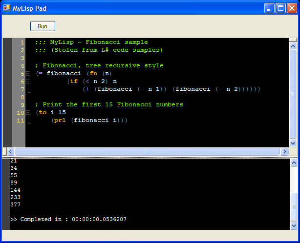

I’ve started to make a very simple editor for MyLisp, just so I can get some highlighting and testrun my snippets.

<!-- truncate -->

Here is the exclusive world first screenshot 😉

Well, thats about it, source and binaries will be out once it’s more complete.  
(The SyntaxHighlight editor component is available for download at [www.puzzleframework.com](http://www.puzzleframework.com/) )
