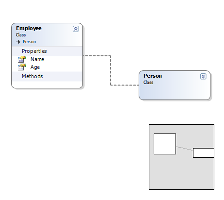
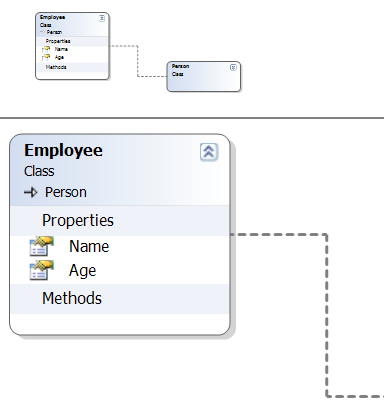
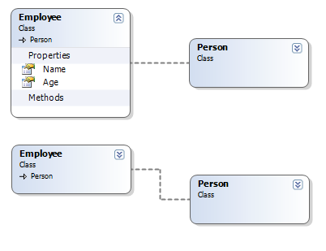
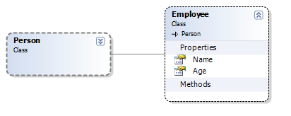

The old ObjectMapper 2000 was and still is a great tool and I have used it in lots of projects to generate and map my entities.  
But one thing that is clear, is that it was way way too complex for most users, it had more settings than the space shuttle and could be a real PITA in some cases.

<!-- truncate -->

So me and Mats have talked about adding mapping support inside VS.NET, much like the Linq to SQL mapping designer.  
We haven’t actually decided exactly how it’s going to work yet, so there is not much to get excited about for now.

Anyway, I’ve started to build a visual class designer for it.  
The control will be possible to use for any kind of Windows Forms project and will not be bound to Object Mapper.

**Screenshots:**

Main view and overview overlay:  

Zoom in and out:  

 Expand / Collapse:  

Custom styles:  

 I’ve also added some auto layout code to it, but it’s based on spring algorithm, which isn’t very good for class diagrams.

Well, if anyone is interested in some colaboration on this one let me know.  
I figure that a decent UML’ish designer could be useful for more than us.  
The plan is to release the designer as a standalone project anyway.
