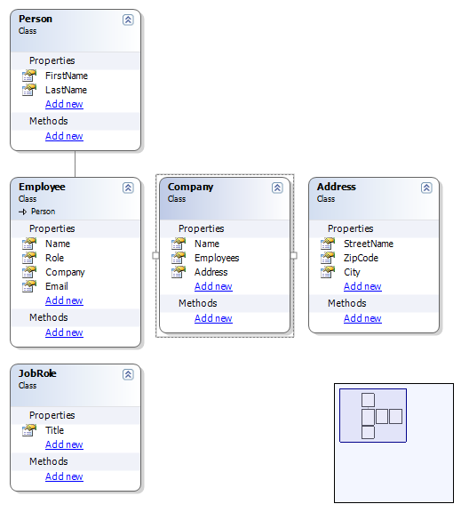

I have published my class designer component at CodePlex.

<!-- truncate -->

You can find binaries and sourcecode here:  
[http://www.codeplex.com/AlbinoHorse](http://www.codeplex.com/AlbinoHorse)

AlbinoHorse is a Windows Forms control for UML Class diagrams that I’m currently developing.  
The idea is to use it in our next version of ObjectMapper. (Mapper tool for ORM entities)

