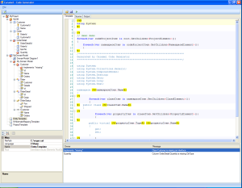

As some of you might know, I’ve been working on a class designer ([Albino horse](http://rogeralsing.com/2008/02/14/albinohorse/)) off and on for a while now.

<!-- truncate -->

I’ve also started to work on a code generator where the class designer will be used.  
The code generator will be a sort of hybrid between old school DB code generator and Puzzle ObjectMapper.

You will be able to edit domain models and table models just like ObjectMapper, but you can also add your own kind of nodes, making it possible to extend the generator for pretty much whatever you want.  
Eg. you could add nodes for different types of web pages and map entities to those and genereate entire apps.

Enough talking, a picture says more than , all the blabbering above 🙂

Very very alpha’ish screenshot of the generator:

 

Once I’ve added a bit more functionallity and cleaned it up a bit I will publish it on codeplex.
