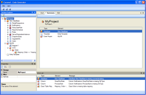
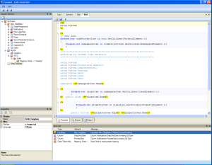
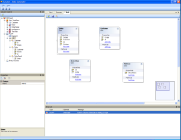

For those who havent read my earlier posts:

<!-- truncate -->

Caramel is a hybrid between old school code generators and Entity Mapping tool.  
You can also plug in your own node types in the meta tree, and thus allowing you to generate pretty much whatever you want.

My intention is to release it with built in support for the most common O/R Mappers so you can build your domain models for NHibernate, NPersist etc in Caramel.

And I might also add some simplistic web page support so you can generate edit/list pages for the mapped entities.

Anyway, here are some new screenshots.

**Summary:**  

**Template Editor:**  

**Class Designer:**  

//Roger
