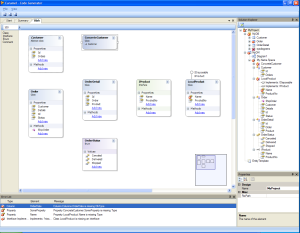

I’ve been working on the class designer this weekend and made some nice progress.  
It is now possible to add interfaces and enums to the designer surface.  
(and alter their members ofc)

<!-- truncate -->

The next thing I have to dig into is to add support for association and inheritance lines.

//Roger
