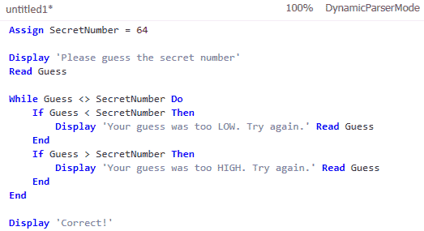

Even though I bashed M Grammar in my [last post](http://rogeralsing.com/2008/11/04/i-call-bs-on-the-oslo-m-language/), I’m sort of starting to get what the fuzz is all about now.

<!-- truncate -->

I still claim that writing grammars is hard, and that the M Grammar language itself doesn’t do much to change this.

But the beauty is not in the parser nor the syntax, it’s in the tools.

The sweet spot of M Grammar is the Intellipad editor shipped with the PDC Bits.

Intellipad, unlike the editors for most other parsers, will give you real time feedback on your progress.  
You can alter your grammar and see how this affects the parse tree for the given input.

You can also annotate your grammar with syntax highlighting hints and thus let you see exactly how the parser handles your input text.  
Intellipad will aslo show you where your grammar suffers from ambiguity by underlining the bad parts with red squigglies.

In Gold Parser which is the parser framework that I have used the most, you will have to compile your grammar and hold your thumbs that there is no ambiguity in the syntax.

The grammar compilation process in GP is quite slow and will only give you some semi obscure feedback on what ambiguous definitions you have.

So I have to admit that Intellipad beats GP big time with its quick and intuitive feedback system.

I haven’t yet played enough with the M Grammar .NET parser to be able to give a fair comparison between Mg and GP when working with parse trees in your code, I will skip this for a later post.

If you have worked with GP before, you won’t have any problems adapting to Mg, the “grammar grammars” are almost identical, with the exception that Mg is slightly more verbose and GP relies more on symbols.

I was able to port a GP grammar to Mg in just a few minutes.  
The ported grammar is the “GP. Simple” grammar.  
**You can find the original GP grammar definition** [**here**](http://www.puzzleframework.com/Blog/Downloads/simple.gold.txt)**.  
And the converted Mg grammar definition** [**here**](http://www.puzzleframework.com/Blog/Downloads/simple.m.txt)**.**

At a first glance the Mg grammar might look much more bloated, there are two reasons for this:  
1) There are currently no predefined char sets in Mg (AFAIK)  
2) The Mg version also contains syntax highlight annotations.

A screen shot of the Intellipad input pane with the “GP. Simple” grammar highlighted is seen here:

By just looking at the input pane when editing my grammar I can assert that my grammar is somewhat correct, I do not have to analyze the parse tree every time I make a change to the grammar.

So in short; Writing grammars are still hard , M Grammar is a pretty standard EBNF engine, but Mg’s tool support beats GP’s toolsupport..

//Roger
