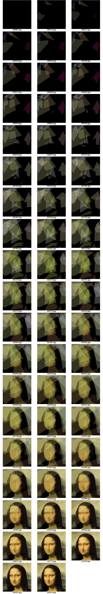

**Added FAQ here:** [**http://rogeralsing.com/2008/12/09/genetic-programming-mona-lisa-faq/**](http://rogeralsing.com/2008/12/09/genetic-programming-mona-lisa-faq/)  
**Added Gallery here:** [**http://rogeralsing.com/2008/12/11/genetic-gallery/**](http://rogeralsing.com/2008/12/11/genetic-gallery/)

<!-- truncate -->

This weekend I decided to play around a bit with genetic programming and put evolution to the test, the test of fine art 🙂

I created a small program that keeps a string of DNA for polygon rendering.  
The procedure of the program is quite simple:

- Setup a random DNA string  (application start)

1.  Copy the current DNA sequence and mutate it slightly
2.  Use the new DNA to render polygons onto a canvas
3.  Compare the canvas to the source image
4.  If the new painting looks more like the source image than the previous  
    painting did, then overwrite the current DNA with the new DNA
5.  Repeat from 1

Now to the interesting part:

**Could you paint a replica of the Mona Lisa using only 50 semi transparent polygons?**

That is the challenge I decided to put my application up to.

The image below is the result of that test:  
The number below each image is the number of generations it took to reach that specific painting.

So what do you think?

**\[EDIT\]  
Added FAQ here: [**http://rogeralsing.com/2008/12/09/genetic-programming-mona-lisa-faq/**](http://rogeralsing.com/2008/12/09/genetic-programming-mona-lisa-faq/)  
**Added Gallery here:** [**http://rogeralsing.com/2008/12/11/genetic-gallery/**](http://rogeralsing.com/2008/12/11/genetic-gallery/)**
