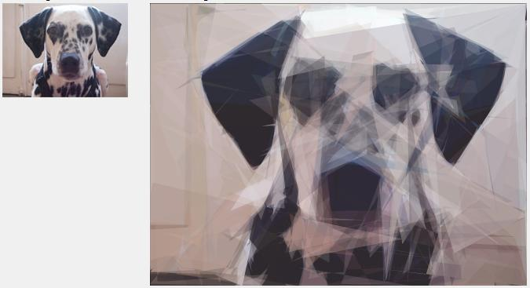
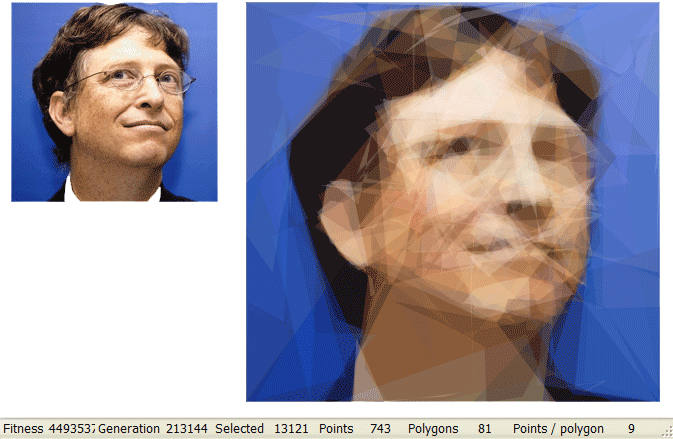
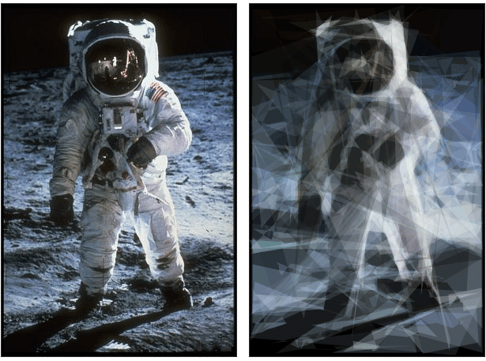
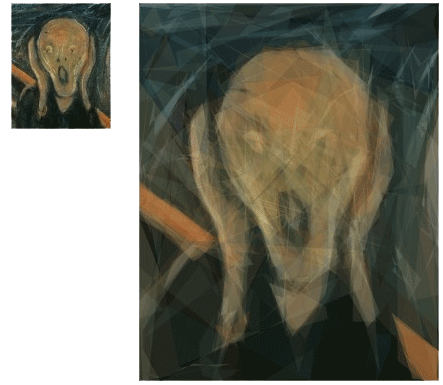
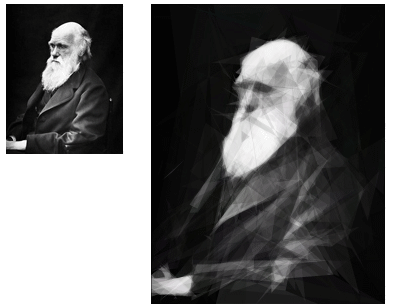
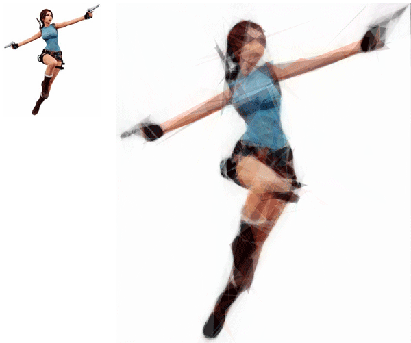
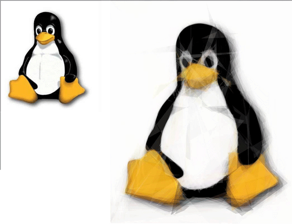
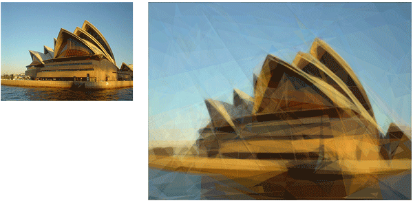
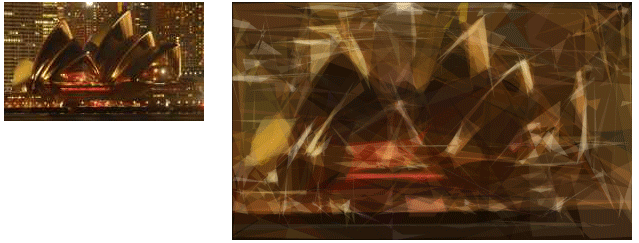

I will be collecting images generated by Evo-Lisa here and make a gallery out of it.  
So if you have a portrait or other image that has been Evo-Lisa’ed that you want to show, please mail them to “Roger dot Alsing at Precio dot se”

<!-- truncate -->

For those of you who don’t know what I’m talking about, please see:  
[http://rogeralsing.com/2008/12/11/genetic-programming-mona-lisa-source-code-and-binaries/](http://rogeralsing.com/2008/12/11/genetic-programming-mona-lisa-source-code-and-binaries/)  
And  
[http://rogeralsing.com/2008/12/07/genetic-programming-evolution-of-mona-lisa/](http://rogeralsing.com/2008/12/07/genetic-programming-evolution-of-mona-lisa/)

### Art painted by evolution

I’ve already gotten the first image:

**Mats Helander’s dog:**

**Bill Gates:**

**Moon man:**

**Scream:**

**Darwin:**

**Lara:**

**Tux:**

**Opera House Day time:**

**Opera House Night time:**

