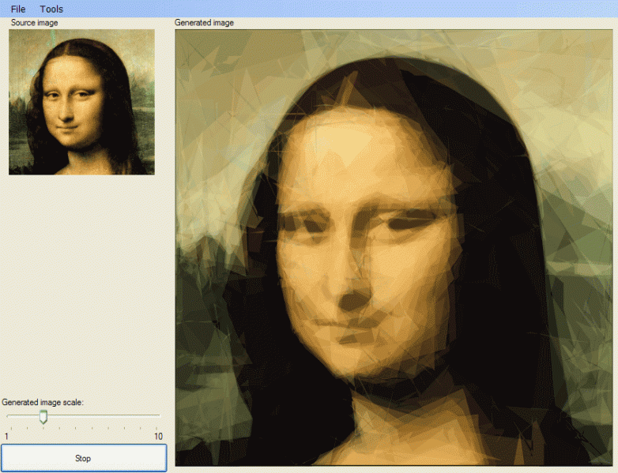

<!-- truncate -->

Source code and binaries are now published:  
[http://code.google.com/p/alsing/downloads/list](http://code.google.com/p/alsing/downloads/list)

The code have been downgraded to .NET 2.0 but the solution files are still VS.NET 2008 format.

Many many thanks to my partner in crime Mats Helander for the .NET 2 port and Options / Serialization extensions.   
Do note that the number of polygons are now configurable, and the image above is composed of about 150 polygons.

Enjoy.

//Roger
