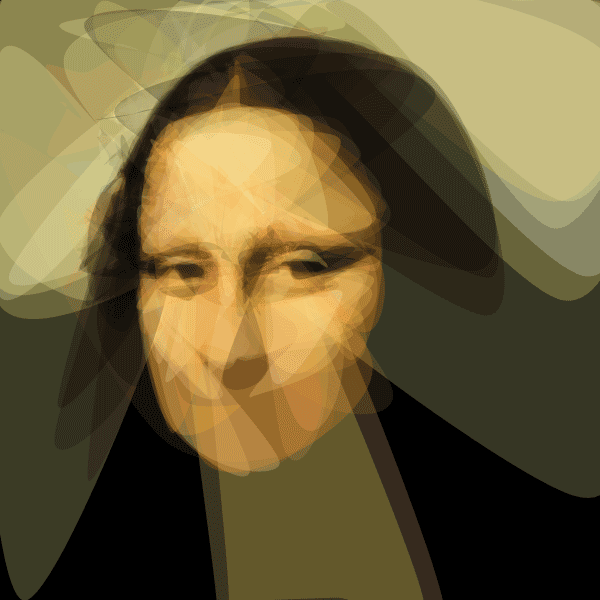

**This is a follow up to:** [**http://rogeralsing.com/2008/12/07/genetic-programming-evolution-of-mona-lisa/**](http://rogeralsing.com/2008/12/07/genetic-programming-evolution-of-mona-lisa/)

<!-- truncate -->

The last few days we have thrown quite a bit of changes onto the EvoLisa app.

[Dan Byström](http://danbystrom.se/2008/12/14/improving-performance/) provided an optimization that resulted in a 25 times performance improvement for the fitness function, completely crazy stuff 🙂

Me and Mats Helander have been discussing ways to make EvoLisa paralellizable to make EvoLisa run on a big computation cluster, and Mats came up with a brilliant idea on how to partition it.  
(More info on that later)

We have also been playing quite a bit with the rendering, added spline rendering and changed how the polygons mutate.

Just check this out:

How cool is that? 😉
