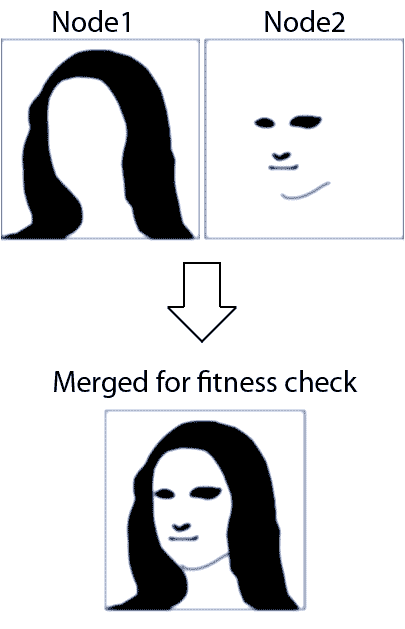

After some horrible failures trying to cluster EvoLisa, I finally succeeded!  
(And some creds goes out to Fredrik Hendeberg on this solution too)

<!-- truncate -->

All of my other attempts failed because of the overhead in the communication.  
I was trying to synchronize things too often, simply because I didn’t see how it would be possible to solve the original Mona Lisa problem w/o doing so.

The key to successful clustering is to communicate as little as possible and run jobs in isolation as much as possible.

And this is what I’ve done now.  
Each node gets ” 50 / NodeCount ” polygons.  
If I have 2 nodes, they get 25 each.

So how do I get those two nodes to paint one and the same image with their 25 polygons each?

The solution is quite simple;  
Each node runs in isolation for e.g. 1000 generations.  
Then they pass their own DNA over to all the other nodes.  
The receiving nodes then construct a “foreground image” and a “background image” based on the DNA from the sending nodes, depending on their ordinal/rank/index in the cluster.  
Once that process is complete, each node goes back to running another 1000 generations, but now using the static fore and background while rendering.

So each node is sort of rendering the entire image, but where all the polygons except for its own are static for X generations.

This works because the longer the simulation runs, the less changes there are to all the polygons.  
So each node can fine-tune it’s own polygons together with the static fore and background since we know that the fore and background will not change that much until the next sync.

There will be a bit of a ping-pong effect in the beginning before all of the polygons on all the nodes start to make sense together.  
But that doesn’t matter because it is only for a short period before everything start to stabilize.

So we are actually co-evolving one organism per node, where all of the organisms needs to harmonize with each other in order to get a good fitness level.  
There is a sort of symbiosis going on now.

As a result of this, the new algorithm is no longer “greedy” and can in some cases result in a worse fitness level than the previous X generations, but the positive effect by far out-weights this.

The effect was quite dramatic on my 2 core laptop.  
With a single core, it takes about 12-20 minutes to reach the fitness level that I use for my tests (The same fitness level as the last image as the original Mona Lisa evolution series).

With two cores, I reach the same fitness in 3-5 minutes.  
That’s a pretty nice speedup.

The performance gain is actually more than 100%, and my best guess is that the OS is eating some of the power of the first core, the one that is used when running in single core mode.

Now I just need to find a multi core computer to see how it works on more than two cores.

//Roger
