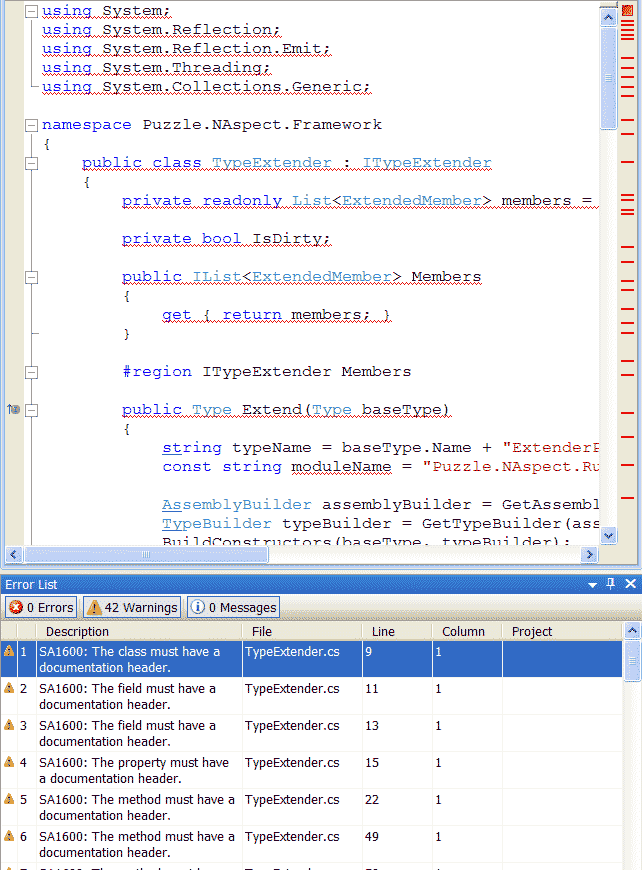

So what do I mean with this title?

<!-- truncate -->

….I have no clue at all  😉

Anyway, a few days ago [Andreas Håkansson](http://www.thecodejunkie.com/) told me to check out [MS StyleCop](http://code.msdn.microsoft.com/sourceanalysis).  
StyleCop is a tool that ensures that you follow a certain code standard, such as naming conventions and general code structure.

Andreas also directed me to a nice Resharper plugin on CodePlex: [http://www.codeplex.com/StyleCopForReSharper](http://www.codeplex.com/StyleCopForReSharper)

This plug in allows you to see the StyleCop warnings directly in your code.

Confident that I was writing at least somewhat decent code, I thought;

“OK, I wonder if StyleCop will find any problems with my code?”

And yes, apparently it could do that..

It was a bit depressing to see how badly my code sucked, but I still decided to make my code conform to the standard that MS uses.  
Most of the problems in there are quite easy to fix, but even if they are easy to fix, its a pain to add things like “this.” in front of all class members in an entire code base.

Luckily, I found this blog post today: [http://blogs.telerik.com/blogs/08-12-05/How_to_minimize_StyleCop_violations_with_ReSharper_reformat_code_feature.aspx](http://blogs.telerik.com/blogs/08-12-05/How_to_minimize_StyleCop_violations_with_ReSharper_reformat_code_feature.aspx)   
Jordan Dimitrov at Telerik shows how to make a Resharper settings file that enables Resharper to format code the way StyleCop wants.

So by using these tools together, you can now use the Resharper *“Cleanup code”* and format the entire code base to be *almost* StyleCop compatible.  
There are a few things that you still need to do manually, e.g. add comments and add parenthesis for operator priority inside expressions.

So if you own a Resharper 4.1 license, I think you should try these tools together, it’s an awesome way to get a code base that completely follows a style guideline.  
Both StyleCop and the add in are free.

//Roger
