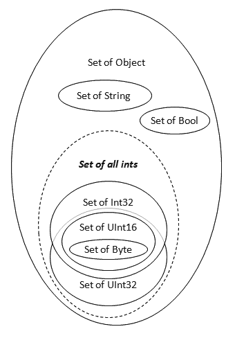
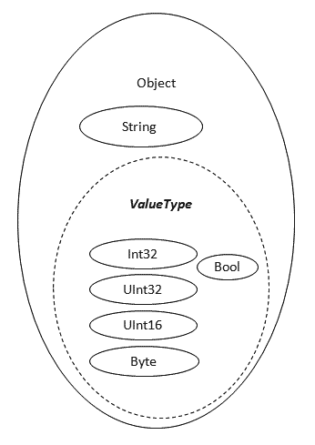

A few days ago I saw an awesome movie where Brian Beckaman talks about monads on channel9: [http://channel9.msdn.com/shows/Going+Deep/Brian-Beckman-Dont-fear-the-Monads/](http://channel9.msdn.com/shows/Going+Deep/Brian-Beckman-Dont-fear-the-Monads/)

<!-- truncate -->

In this movie he explains that one can reason about “Types” just like a “Set”

Brian never goes into deeper details about this in the movie, so this post will deal with my own thought on this matter only.  
So don’t hold him responsible for anything crazy that I might write 🙂

I found this topic quite interesting, I have never thought about it this way, but it does makes perfect sense.

e.g. Imagine the Type “Byte”, it represents an integer number from 0 to 255.  
And thus, all the valid forms of a byte would fit in a set with 256 elements.

The type “Int32” also represents an integer number, but with a larger precision.  
But it still models the exact same concept, the concept of an integer value.  
Every valid form of an Int32 will also fit into a set, however much larger than the byte set.

Since both types models the same concept, but with different precision, the smaller set can be seen as a subset of the larger set.  
That is; the byte set is a sub set of the Int32 set.

**Type set diagram:**  
  
One intereting thing that this brings to the table, is that it allows us to reason about type casts.  
e.g. Since the byte set is a subset of Int32, we can know that any element found in the byte set, will also exist in the Int32 set.  
So we can assume that we can pick any element from a bag of Bytes and put it into a bag of Int32s.

And this is exactly what we can do when we write programs (at least in most languages), we can make an implicit type cast from byte to Int32.  
Simply because bytes belongs to a subset of Int32, even though the byte is not a sub *type* of Int32.

The **inheritance graph** for these types looks quite different than the Set diagram:

The types that represent integer values in the inheritance diagram shows that they do not have a parent / child relation.  
They are unrelated except for shared base of ValueType, but you can still do implicit casts from one type to another when the source type belongs to a subset of the destination type.

This is quite obvious facts when dealing with integers, and I guess that most developers already knew when it is possible to do implicit casts from one type to another.  
But if we ignore the über obvious for a second and think about what this can be used for:

This does allow us to reason about our OWN types, when and where it makes sense to allow implicit or explicit casts and not.

I have never really had any good approach for this before, I pretty much only threw in implicit cast operators here and there without much thought.  
But by thinking of types as sets, it is easy to see if your custom types are a sub/super set of another type, and then allow implicit or explicit casting based on that.  
And it might even show you that your types are not overlapping sets at all, and in such case you might want to create transformer / factory methods instead of allowing any type of casting.

e.g. a type that is a string representation of a week day might look like should allow implicit casts to string.  
But since they model different concepts; weekday vs. string, those sets are not overlapping.  
And thus, you should not allow any sort of casting, but rather supply a “WeekDay.Parse” method or something similar.

While if you were to invent your own Nullable of T type, you could easily see that any instance of T would also fit into the set of Nullable T.  
And thus you should allow implicit casts from T to Nullable of T.

Well, that’s all..  
I hope this wasn’t far too crazy 🙂

//Roger
