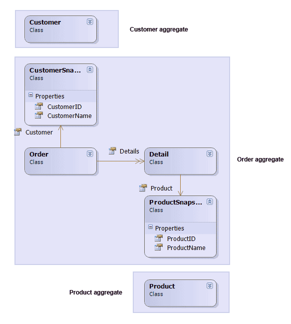

I have been trying to practice domain driven design for the last few years.  
During this time, I have learnt that there are almost as many ways to implement DDD as there are practitioners.

<!-- truncate -->

After studying a lot of different implementations I have seen two distinct patterns.

I call the first pattern **“Aggregate Graph”**:

When applying aggregate graphs, you allow members of one aggregate to have direct associations to another aggregate.  
For example, an “Order” entity which is part of a “Order aggregate” might have a “Customer” property which leads directly to a “Customer” entity that is part of a “Customer aggregate”.

 

According to Evans book this is completely legal, any member of an aggregate may point to the root of any other aggregate.  
Evans is very clear on the matter that aggregate root identities are global while identity of non root entities are local to the aggregate itself.

The opposite pattern would be what I call **“Aggregate Documents”**:

Here the aggregates never relate \_directly\_ to other aggregate roots.  
Instead, the associations may be designed as “snapshots” where you store light weight value object clones of the related aggregate roots.  
An “Order” entity would have a “Customer” property which leads to a “CustomerSnapshot” value object instead of a Customer entity.  
This way each aggregate instance becomes more of a free-floating document.

Since I have been applying both of these patterns, I will try to highlight the pros and cons of them in the rest of this post.

## Aggregate Graph

The Aggregate Graph pattern is the approach I used when I first started doing DDD and I think that it is the most common way to implement DDD.  
Since I was an O/RM developer (NPersist) this felt very natural to me, I could design my object graph in our design tool and then draw a few boxes on top of it and claim that those were my aggregates.  
I most often used eager load inside the aggregates and lazy load between aggregates in order to avoid that the entire database was fetches when one aggregate instance was loaded.

This had a very nice “OOP” feel to it, I was working with objects and associations and I could ignore that there even was a database involved.

My “Repositories” were mere windows into my object graph, I could ask a repository to give me one or more aggregate roots and from those object I could pretty much navigate to any other object in the graph due to the spider web nature of the aggregate graph.

The pros of this approach is that it is easy to understand, you design your domain model just like any other class model.  
It also works very well with O/R mappers, features like Lazy Load and Dirty Tracking makes it all work for you.

However, there are a few problems with this approach too.  
Firstly, Lazy Load in O/R mappers is an implicit feature, there is no way for a developer to know at what point he will trigger a roundtrip to the database just by reading the code.  
It always looks like you are traversing a fully loaded object graph while you are in fact not.  
This often leads to severe performance problems if your development team don’t fully understand this.

I have seen reports over this kind domain models where the implicit nature of Lazy Load have caused some 700 round-trip to the database in a single web page.

This is what you get when you try to solve an explicit problem in an implicit way.

If you are going to use Lazy Load, make sure your team understands how it works and where you use it.

Another problem with this approach arise when you need to fill your entities with data from multiple sources.  
Many of the applications I build nowadays relies on data from multiple sources, it could be a combination of services and internal databases.

When using Lazy Load to get related aggregates, there is no natural point where you can trigger calls to the other data sources and fill additional properties.  
You will most likely have to hook into your O/R mapper in order to intercept a lazy load and call the services from there.  
nowadays, I mostly use the second approach, Aggregate Documents.

## Aggregate Document

Aggregate Document approach is much more explicit in its design.  
For example, if you want to find the orders for a specific customer;  
Instead of navigating the “Orders” collection of “Customer”, you will have to call a “FindOrdersByCustomer” query on the “OrderRepository”.

While I do agree that this looks less object oriented than the first approach, this allows developers to reason about the code in a different way.  
They can see important design decisions and hopefully avoid pitfalls like ripple loading.

Another benefit is that since you only work with islands of data, you can now aggregate data from multiple sources much easier.  
You can simply let your repositories aggregate the data into your entities.  
*(If you do it inside the actual repository or let the repository use some data access class that does it for it is up to you)*  
  
You don’t have to hook into any O/RM infrastructure since you no longer rely on lazy load between aggregates.

Personally I use eager load inside my aggregates, that is, I fetch “Order” and “Order Detail” together as a whole.  
A side effect of this is that since I don’t use Lazy Load between aggregates and don’t use Lazy Load inside my aggregates, my need for O/R mapping frameworks drops.  
I can apply this design without using a full-fledged O/R mapper framework.  
I’m not saying that you should avoid O/R mapping, just that it is much easier to apply this pattern if you can’t use an O/R mapper for some reason.

This also makes it easier to expose your domain model in an SOA environment.  
You can easily expose your entities or DTO versions of them in a service.

Lazy Load and services don’t play that well together.

Maybe it looks like I dislike the first approach, this is not the case, I may very well consider it in a smaller project where there is just one data source and where the development team is experienced with O/R mapping.  
You can also create hybrids of the two approaches;  
e.g. In Jimmy Nilsson’s book “Applying Domain Driven Design and Patterns” there are examples where an “Order” aggregate have a direct relation to the “Product” aggregate while the same “Order” aggregate uses snapshots instead of direct references to the “Customer” aggregate.

Snapshots also comes with the benefit of allowing you to store historical data.  
The snapshot can for example store both the CustomerId and the name of the customer at the time the order was placed.

Thats all for now.

//Roger
