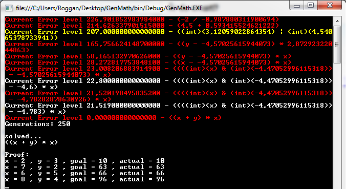

Here in sweden there are currently circulating some email with a challange about solving a math puzzle.  
It’s nothing special really but the mail goes something like this (translated):  
(Don’t blame me for the claims in the quote, it’s not my words)

<!-- truncate -->

> It’s said that only people with an IQ over 120 can solve the following problem:
>
> If we assume that:  
> 2 + 3 = 10  
> 7 + 2 = 63  
> 6 + 5 = 66  
> 8 + 4 = 96
>
> How much is?  
> 9 + 7 = ????

The mail contains an excel file with a password and can only be opened if you know the answer to the above.

Just for the hell of it I entered the problem into my old genetic expression evolver:  
[http://rogeralsing.com/2008/02/07/genetic-programming-math/](http://rogeralsing.com/2008/02/07/genetic-programming-math/)

The application is based on genetic programming and does use genetic crossover and a real population (unlike my EvoLisa sample).

The problem was described like this:  
problem.Cases.Add(new Case(2, 3, 10));  
problem.Cases.Add(new Case(7, 2, 63));  
problem.Cases.Add(new Case(6, 5, 66));  
problem.Cases.Add(new Case(8, 4, 96));

The first and second arguments are variable values and the last argument is the expected output.

And here is the output of the application:

As you can see on the screenshot, the application have solved the equation in 250 generations (a few milliseconds).

That’s probably faster than you solved it 😉

PS.  
If it makes you feel better, I didn’t solve it at all, I go into fetus position on the floor when I see math problems 😉

//Roger
