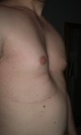
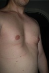
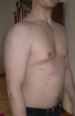
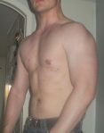
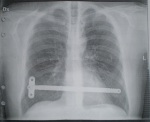
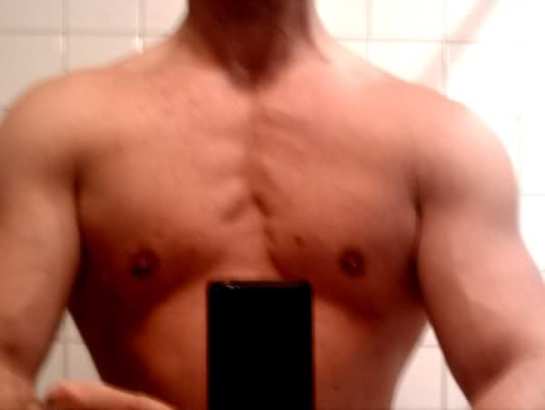
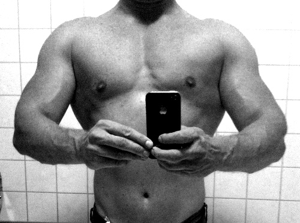

This is a completely off topic post about my personal life.

<!-- truncate -->

I’m now back at home after one week at hospital due to chest reconstruction.  
Since my teens I’ve got Pectus Excavatum, a chest deformity where the chest bone is deformed and gives the chest a concave appearance.  
Pectus affects about 1 out of 1000 people.

In my case, the PE was not only cosmetic, it also gave me chest pains when deep breathing and also putting pressure on my heart.  
When I was a teen, the only way to fix the problem was to cut the ribcage open and cut everything off and then rebuild a new chest.  
That alternative wasn’t very appealing to me so I did not do anything about it at that point.

However, now some 20ish years later, I found out about the Nuss procedure, a procedure where you implant a steel bar into the chest, putting preassure on the chest bone and ribcage from the inside and thus forcing a correct shape.  
The Nuss procedure have apparently been around for some 10 years, but I guess there are no newsletters for that kind of information 😉

The reason why I write this post is because I found it very hard to find information regarding Nuss for adults, e.g. information about how long I should expect to be off from work, and what results to expect from the procedure.

So here are some facts.

Age: 34  
Pectus: Mild/Medium  
Procedure duration: 1.5 H  
Time in hospital: 6 days  
Pain after procedure:  Way less than expected, was up and walking the day after.

Current status: 9 days since procedure and I feel quite OK with some occasional pain spikes.  
Putting on socks or getting in and out of the car is extremely painful.  
And don’t even think about sneezing 😉

**Before images:**

 

As can be seen on the “before images”, my chest bone was sunken into my chest by some 2-3cm.

**After images one week post op:**

 

These images are taken 9 days after the procedure.  
The steel bar was inserted just below my man-boobs (where the tape is).

I will now have the bar for about 3 years before it is removed and hopefully the bones have been re-shaped by that time.

**\[Update\]  
After images, 4 months later**

Changed my diet after the surgery, got rid of the worst parts of the pot belly.

**X-Ray:**

I guess I can’t get through airport security checks anymore…

Update  
Two years later  

2.5 years later.

Pretty much back at the strength and size I was when I was 20.  
Benchpressing 140kg with the nussbar inside 🙂
