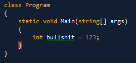

Today I attended one of Juval Löwy’s sessions on our inhouse conference.

<!-- truncate -->

He argued that every object in .NET is a COM object behind the scenes, even Int32.  
Fair enough, Int32 is a type and it does have a Guid.  
The argument was an attempt to show that .NET is slow and that everything is pushed around as a COM object internally, even the integers…  
(This was an up ramp for his “every object should be a WCF service”, to show that performance doesn’t matter, much..)

This is however completely wrong..  
.NET have specific IL op codes in order to deal with primitives, and those opcodes will translate to pure machine code.

Here is a C# code snippet:

Here is the same code disassembled into x86

The value hex 7B (dec 123) is moved directly into the memory slot for the local variable.  
No COM objects involved, no nothing, just normal machinecode, as long as you treat it as an int that is..  
You can not make this faster or better even if you resort to pure ASM.
