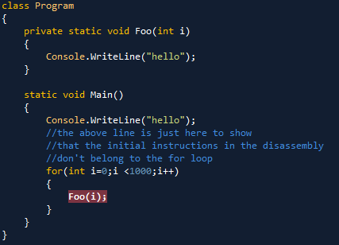
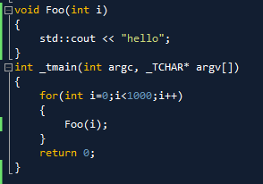
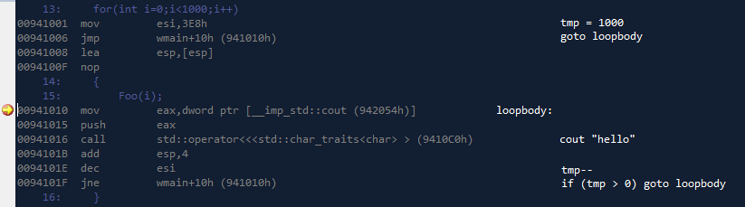
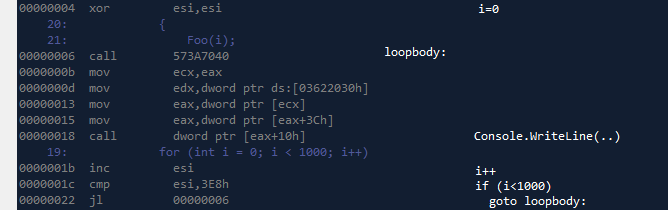

**.NET Disassembled**  
Part 1: [integers in .NET](http://rogeralsing.com/2011/02/05/integers-in-net/)  
Part 2: This post

<!-- truncate -->

This is my second post on .NET performance, in this series of posts I will try to show how .NET code performs compared to pure C++ code.  
Today I will show how a C# for loop compares to a Win32 C++ for loop.

First we need some sample code to compare, so here it is:

**The C# code:**

**The Win32 C++ code:**

I hope we can agree that the above code is fairly similair, we loop “i” from 0 to 999 and call the function “Foo” while doing so.

I will begin with the disassembly for the C++ code, just so we can see how optimized it is:

What are we seeing here?  
The “i” variable have been replaced with a native register (esi) which is set to 1000.  
The Foo function have been inlined in the for loop.  
The loop guard have been optimized to “esi — ; if esi \>0 goto loopbody” since this is more efficient in native code (dec,jne)  
So the C++ code is clearly very optimized.

So how does the C# counterpart hold up against the optimized C++ code?  
**\[Edit\] big thanks to Omer for pointing out how to disassemble the optimized .NET code.**

Just like the C++ version, the variable “i” have been replaced with a native register, “esi”  
The Foo function call have been inlined (address 6-18), do note that calling console.writeline is not the same as calling cout in win32, so the code will differ.  
So the optimized .NET code is pretty much equal to the win32 C++ version.

Hope this can crush some of the myths floating around…

//Roger
