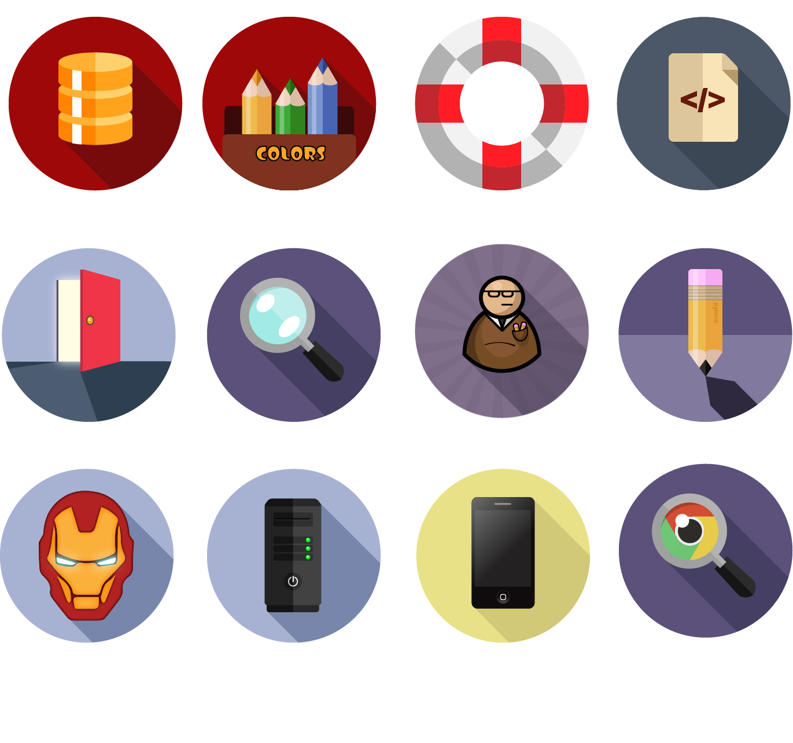

I’ve started doing some graphics again, quite some time have passed since I quit my demo scene graphics days (/noice/fairlight/wrath designs)  
I’m paining some random flat’ish icons on my free evenings now, just to clear my head.  
Use if you like..  

<!-- truncate -->

<figure id="attachment_1388" class="wp-caption alignnone" data-shortcode="caption" aria-describedby="caption-attachment-1388" style="width: 584px">

<figcaption>icons</figcaption>
</figure>
