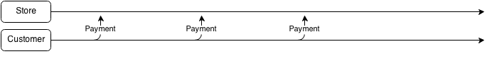

One question that often shows up when talking about the Actor Model, is how to deal with distributed transactions.

<!-- truncate -->

In .NET there is the concept of MSDTC, Microsoft Distributed Transaction Coordinator, that can be used to solve this problem when working with things like SQL Server etc.

The MS Research project Orleans (MS Azure Actor framework) also supports distributed transactions.  
See 3.8 [http://research.microsoft.com/pubs/153347/socc125-print.pdf](http://research.microsoft.com/pubs/153347/socc125-print.pdf) on this.  
**\[Edit\]** The transactions described in that paper was revoked, the Orleans team are currently working on a new implementation.

The problem with distributed transactions is that they are expensive, very expensive, they do not scale very well.

We as programmers are also trained to think of transactions as some sort of binary instant event that occurs, it either succeeds or it fails, and the time span is very short, but during this timespan, you freeze and lock everything that is involved with it.

In the real world however, transactions are more fuzzy, they don’t necessarily succeed or fail in a binary fashion, and they are far from instant.

And just to avoid confusion here, lets think of this as technical transactions vs. business transactions. In the end, they both ensures a degree of consistency, even though the concepts are different.

In the actor world, we can approach this the same way that the Saga pattern works.  
See [@Kellabytes](https://twitter.com/kellabyte) excellent post on this topic: [http://kellabyte.com/2012/05/30/clarifying-the-saga-pattern/](http://kellabyte.com/2012/05/30/clarifying-the-saga-pattern/)

In Kellys post, she talks about failures in a technical context, but the failure could very well be a failure to comply to an agreement also. there would be no distinction between technical and business failures.

Let’s say that you purchase something on credit in a store, you make up a payment plan that stretches over X months.  
During this time, you agree to pay Y amount of money at the end of each month for example.  
If you do so, everything is fine, if you don’t, the store will send you a reminder, and if you still don’t pay, you will get fined.  
This is a transaction that stretches over a very long time, and it can partially succeed.

**Happy path:**

**Partial failure with compensating action:**

  
**Complete failure with compensating action:**

This is how you could model business transactions in a distributed system, it is asynchronous and it scales extremely well.

When two or more parties begin a transaction, all parties have to agree to some sort of contract before the transaction starts, this is your message flow, much like a protocol, that defines what happens if you violate the contract.A scheme of messages and actions that describe exactly how your (business) transaction is supposed to be resolved, and which of the involved parties that needs to ensure that a specific part of this agreement is handled.

This will make your transactional flow very business oriented, it goes very well with the concept of domain driven design. The transactional flow is actually just a process of domain events.
