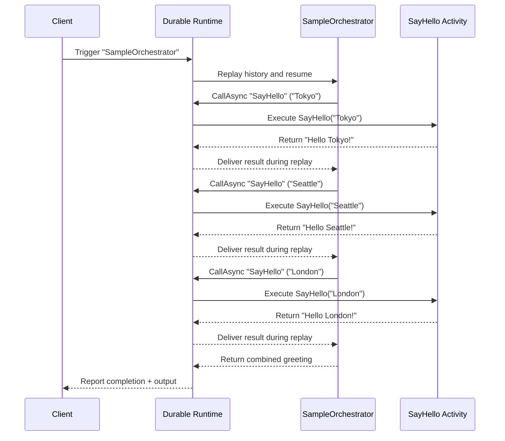

# Getting Started

The samples folder in the public repository demonstrates every feature, but you only need a handful of steps to run your first orchestration.

## 1. Add the NuGet packages

```bash
dotnet add package Asynkron.DurableFunctions
```

Add `Asynkron.DurableFunctions.Extensions` if you want the ASP.NET Core helpers or management API.

## 2. Create your orchestrator and activities

The `SampleOrchestrator` example keeps the functions intentionally small so the control flow is easy to follow. The comment markers show where the runtime injects durable behaviour.

```csharp title="SampleOrchestrator.cs"
using Asynkron.DurableFunctions.Attributes;
using Asynkron.DurableFunctions.Core;

public class SampleOrchestrator
{
    [FunctionName("SampleOrchestrator")]
    public async Task<string> RunAsync([OrchestrationTrigger] IOrchestrationContext context)
    {
        // Durable calls automatically replay when the orchestration is resumed.
        var tokyo = await context.CallAsync<string>("SayHello", "Tokyo");
        var seattle = await context.CallAsync<string>("SayHello", "Seattle");
        var london = await context.CallAsync<string>("SayHello", "London");

        return $"{tokyo}, {seattle}, {london}";
    }

    [FunctionName("SayHello")]
    public string SayHello(string name) => $"Hello {name}!"; // Activity executions are not replayed
}
```

The orchestration progresses step by step as the runtime replays deterministic decisions and dispatches the `SayHello` activity for each city.



## 3. Configure and start the runtime

The console host in `Program.cs` mirrors what you would normally do in `CreateHostBuilder` inside ASP.NET Core. Use the concurrent runtime to make multi-instance deployments safe by default.

```csharp title="Program.cs"
using Asynkron.DurableFunctions.Core;
using Asynkron.DurableFunctions.Persistence;
using Microsoft.Extensions.Logging;

var loggerFactory = LoggerFactory.Create(builder => builder.AddConsole());
var stateStore = new ConcurrentSqliteStateStore("Data Source=functions.db", loggerFactory.CreateLogger<ConcurrentSqliteStateStore>());
var runtime = new ConcurrentDurableFunctionRuntime(stateStore, loggerFactory.CreateLogger<ConcurrentDurableFunctionRuntime>(), loggerFactory: loggerFactory);

runtime.RegisterOrchestrator<string, string>("SampleOrchestrator", new SampleOrchestrator().RunAsync);
runtime.RegisterFunction<string, string>("SayHello", name => Task.FromResult($"Hello {name}!"));

await runtime.StartAsync(CancellationToken.None); // Keeps polling storage for work
```

## 4. Trigger the workflow

The runtime exposes strongly-typed helpers for starting, querying, and signalling orchestrations. In a console app you can trigger directly from code; in ASP.NET Core you would usually call these from controllers or background services.

```csharp
var instanceId = await runtime.TriggerAsync(
    instanceId: string.Empty,              // leave empty to auto-generate IDs
    orchestratorName: "SampleOrchestrator",
    input: "Durable Functions" // payload is JSON-serialised
);

var status = await runtime.GetStatusAsync(instanceId);
Console.WriteLine($"{status.RuntimeStatus}: {status.Output}");
```

At this point you have a working orchestration loop. Read the next sections to learn how to model workflows, wire the runtime into ASP.NET Core, and monitor the system in production.
