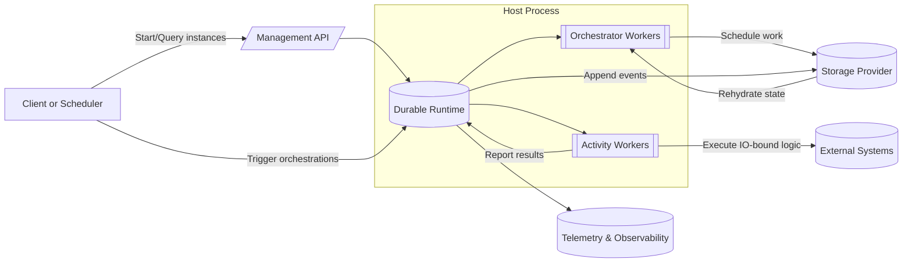

# Asynkron Durable Functions

Asynkron Durable Functions brings the familiar Azure Durable Functions programming model to any .NET environment. You register orchestrators and activities with a runtime, back it with the storage provider that fits your deployment, and the framework coordinates reliable, resumable workflows for you.

> **Project links**
> - Source repository: [asynkron/Asynkron.DurableFunctions.Public](https://github.com/asynkron/Asynkron.DurableFunctions.Public)

The runtime focuses on three goals:

- **Productive orchestration model** – deterministic orchestrators that call activities, wait on events, schedule timers, and compose sub-orchestrations using plain C#.
- **Portable hosting** – run inside minimal console apps, ASP.NET Core services, containers, or anywhere a .NET runtime is available.
- **Operational confidence** – multi-host safety, management APIs, and first-class telemetry make the workflows observable and easy to run in production.

Use the rest of the Durable Functions documentation set to learn how to build, host, and operate orchestrations with confidence.

## How the runtime fits together

The Durable Functions runtime is a set of cooperating services that make deterministic orchestrations possible. The diagram below highlights the major moving parts you will interact with when building an application.

Orchestrator workers never touch external systems directly; they emit decisions into the event history stored in the backing provider. Activity workers then execute the side effects and report results that resume the orchestrator. Management calls and telemetry operate alongside the runtime, ensuring you can observe and control every instance.
