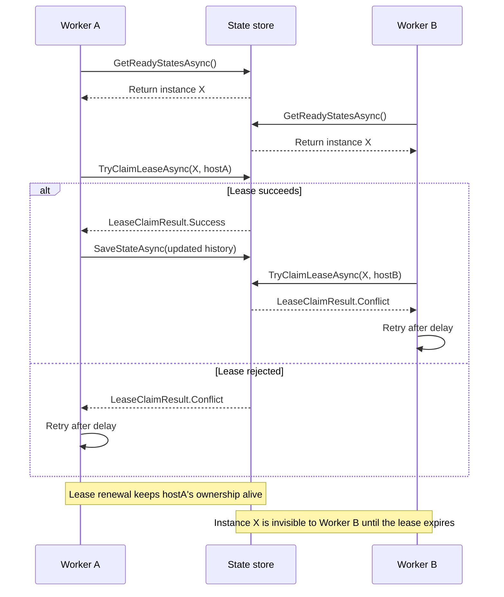
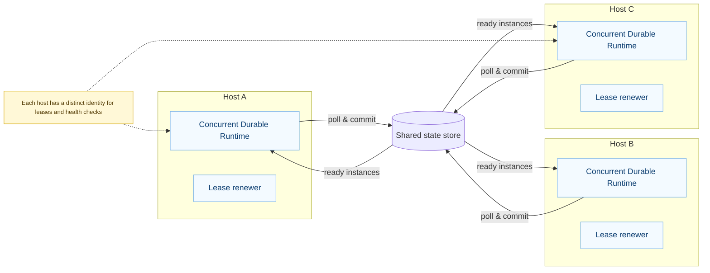

# Operating at scale

Durable workflows are stateful by design. Keep the following practices in mind when you move from experiments to production.

## Orchestrator leases

The concurrency subsystem guarantees that only one host executes a given instance at a time.

The diagram below shows two workers racing for the same orchestration instance. Only the worker that successfully updates the
lease metadata (`Version`, `LeaseOwner`, and `LeaseExpiresAt`) is allowed to continue replaying and committing history. The
other worker backs off and looks for the next claimable instance.

- **Claim** – hosts atomically claim work by updating the `Version`, `LeaseOwner`, and `LeaseExpiresAt` columns. The compare-and-swap logic prevents duplicate execution.
- **Renew** – long-running orchestrations renew their lease halfway through the lease window. If the process crashes the lease simply expires and another host claims the work.
- **Release** – leases are cleared on completion, failure, or termination so the instance can be archived immediately.

Tune `LeaseTimeout` and `LeaseRenewalInterval` in configuration to balance failover speed with database load. The defaults (30 seconds with 10 second renewals) work for most workloads.

## Scaling out

- **Multiple workers** – use `ConcurrentDurableFunctionRuntime` plus a shared relational store (SQLite with WAL or PostgreSQL) so hosts coordinate safely.
- **Throughput** – increase `MaxConcurrentOrchestrations` gradually. Combine with rate limiting on downstream services to avoid overload.
- **Polling** – the runtime polls storage for new work. Observe storage metrics before lowering the `PollingInterval`.

## Health monitoring

- Expose Prometheus or OTLP metrics and build dashboards around orchestration counts, failure rates, and lease usage.
- Alert on a rising `orchestrations.failed` counter or a sustained high `lease.active_count`—both indicate stuck work.
- Track management API usage. A spike in terminations or purges often means downstream dependencies are failing.

## Troubleshooting checklist

1. **Replay-safe logging** – use `context.CreateReplaySafeLogger()` (or the typed `context.GetLogger()`) for statements inside orchestrators. Standard logging can flood logs during replays.
2. **Determinism** – keep orchestrators pure. Move non-deterministic calls (random numbers, `DateTime.UtcNow`, network calls) into activities.
3. **State size** – large inputs/outputs slow down persistence. Store big payloads externally and reference them by ID when possible.
4. **Cleanup** – enable automatic purge policies or schedule regular purges using the management API to keep tables lean.

Following these practices keeps orchestrations responsive even as you scale to many workers.
