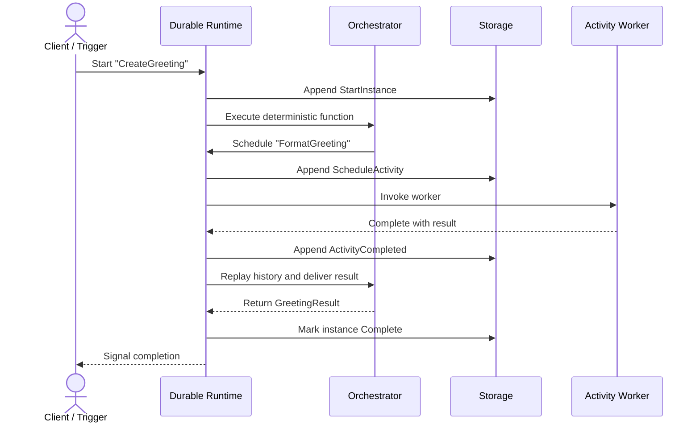
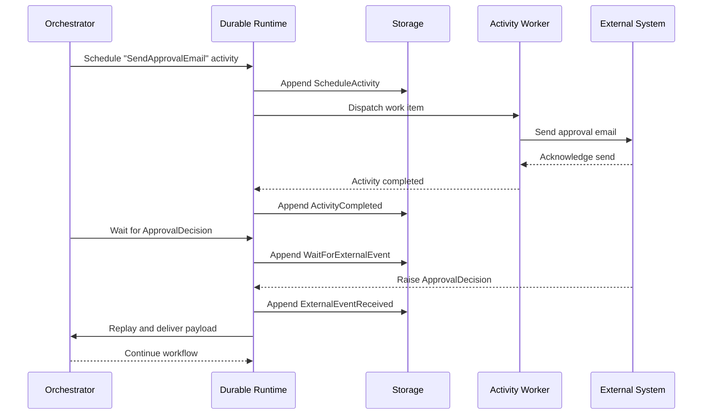
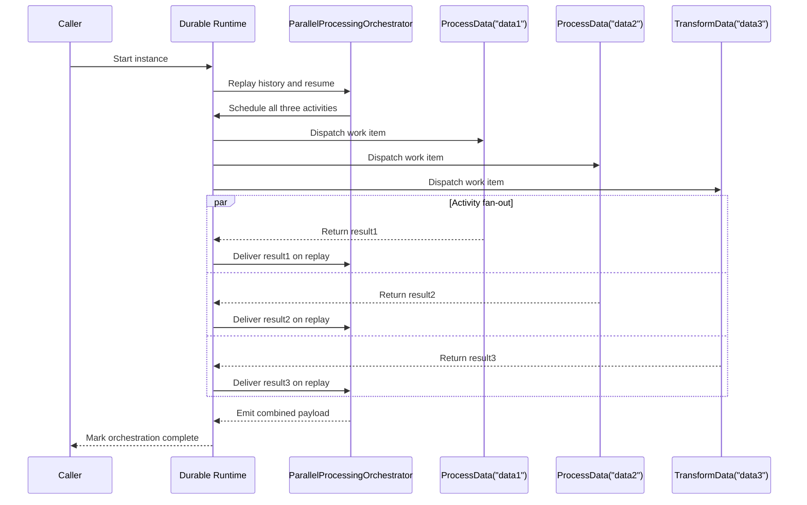
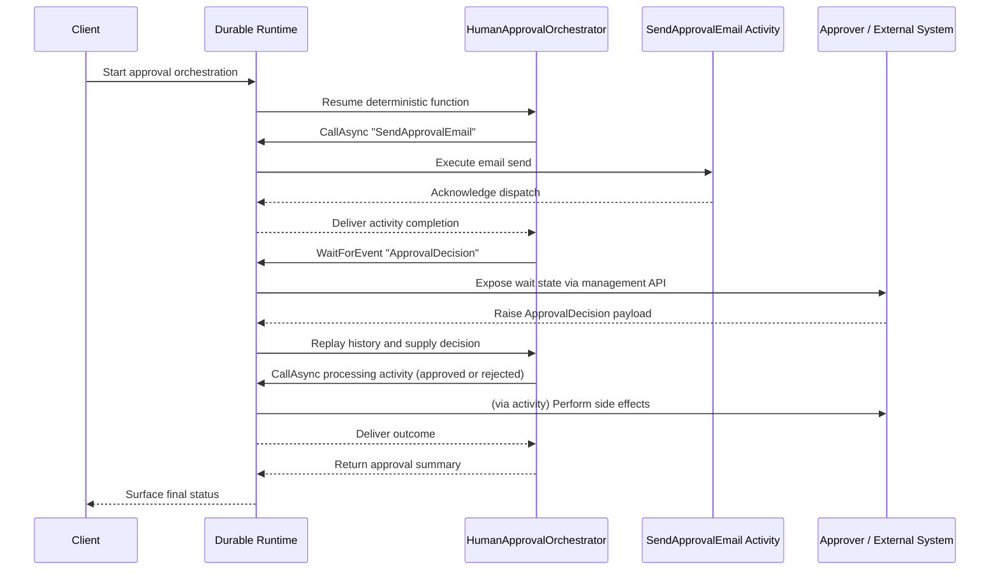
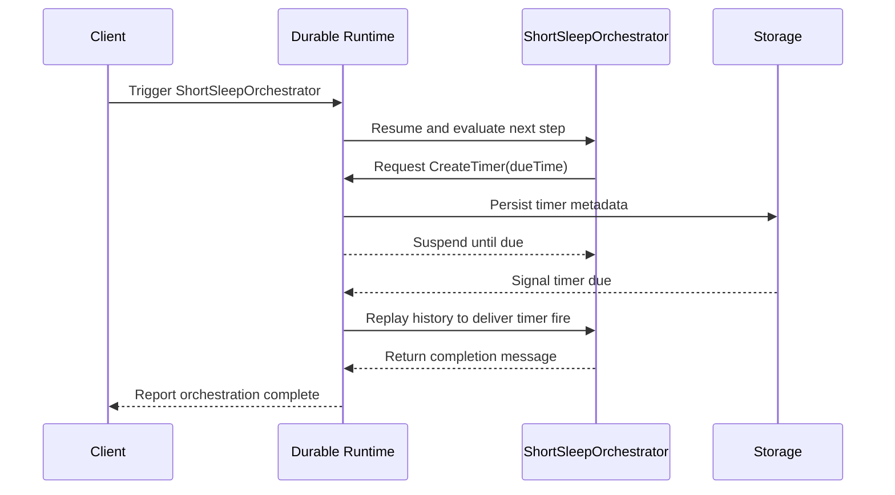
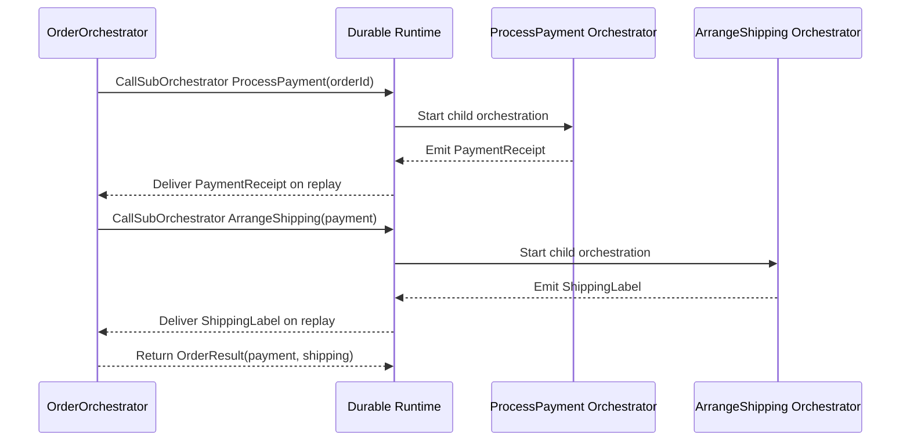
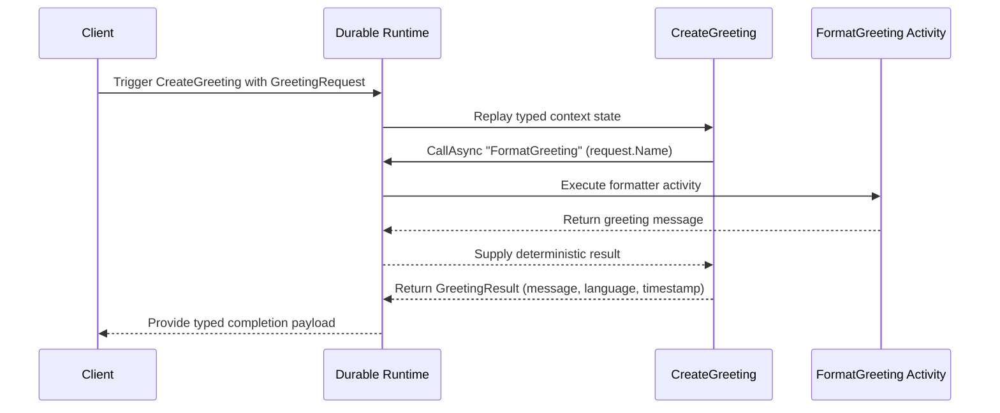

# Orchestration patterns

The examples directory in the public repository maps every major concept to a runnable sample. Use the snippets below as a starting point and adapt them to your domain.

## Visualising orchestrator lifecycles

Durable orchestrators run deterministically: they emit decisions, persist them to storage, and replay from history whenever the runtime needs to resume work. The sequence diagrams below show how that coordination plays out in practice.



Waiting for external input follows the same deterministic workflow. The orchestrator records that it is waiting, and the runtime resumes execution only after the event arrives.



These diagrams mirror the call sites you will see in the code listings below, helping you map orchestration APIs to the underlying control flow.

## Parallel work (fan-out/fan-in)

`SqliteExample` launches three activities in parallel and waits for all of them before emitting a combined result.

```csharp title="SqliteExample.cs"
runtime.RegisterJsonOrchestrator("ParallelProcessingOrchestrator", async (context, _) =>
{
    Console.WriteLine("Starting parallel activities...");

    // Activities execute in parallel and the orchestrator resumes once all complete.
    var task1 = context.CallAsync<string>("ProcessData", "data1");
    var task2 = context.CallAsync<string>("ProcessData", "data2");
    var task3 = context.CallAsync<string>("TransformData", "data3");

    var results = await Task.WhenAll(task1, task2, task3);
    return $"Combined: {string.Join(", ", results)}";
});
```



Because orchestrators are replayed deterministically, avoid non-deterministic APIs (like `DateTime.UtcNow`) in the body. Log progress with `context.CreateReplaySafeLogger()` if you need structured logging.

## Human-in-the-loop workflows

`ExternalEventsExample` suspends execution until an external approval arrives.

```csharp title="ExternalEventsExample.cs"
runtime.RegisterOrchestrator<ApprovalRequest, string>("HumanApprovalOrchestrator", async (context, request) =>
{
    await context.CallAsync("SendApprovalEmail", request); // Notify the approver

    Console.WriteLine("Waiting for human approval...");
    var approvalResponse = await context.WaitForEvent<ApprovalResponse>("ApprovalDecision");

    if (approvalResponse.Approved)
    {
        await context.CallAsync("ProcessApprovedRequest", request);
        return $"Approved by {approvalResponse.ApproverName}";
    }

    await context.CallAsync("ProcessRejectedRequest", request);
    return $"Rejected by {approvalResponse.ApproverName}";
});
```



Raise events with `runtime.RaiseEventAsync(instanceId, "ApprovalDecision", payload)` or via the HTTP management API once the person (or system) has responded.

## Durable timers

`TimerOrchestrationExample` demonstrates the canonical timer pattern.

```csharp title="TimerOrchestrationExample.cs"
[FunctionName("ShortSleepOrchestrator")]
public async Task<string> ShortSleepOrchestrator([OrchestrationTrigger] IOrchestrationContext context)
{
    var dueTime = context.CurrentUtcDateTime.AddSeconds(30); // no DateTime.UtcNow in orchestrators
    await context.CreateTimer(dueTime);

    return "Woke up after 30 seconds!";
}
```



Timers are persisted alongside orchestration state. If the process crashes, the runtime simply reschedules execution at the correct moment.

## Sub-orchestrations

Keep complex workflows maintainable by delegating to child orchestrators. `SubOrchestratorExample` coordinates payment and shipping flows and then combines both results.

```csharp title="SubOrchestratorExample.cs"
var payment = await context.CallSubOrchestratorAsync<PaymentReceipt>("ProcessPayment", orderId);
var shipping = await context.CallSubOrchestratorAsync<ShippingLabel>("ArrangeShipping", payment);

return new OrderResult(payment, shipping);
```



Sub-orchestrators inherit all the reliability guarantees of the parent workflow while keeping the surface area of each orchestrator small.

## Strongly-typed APIs

The `SimpleTypedOrchestratorDemo` proves that you do not have to work with raw `object` parameters. Typed contexts unlock IntelliSense, validation, and refactoring support.

```csharp title="SimpleTypedOrchestratorDemo.cs"
runtime.RegisterOrchestrator<GreetingRequest, GreetingResult>("CreateGreeting",
    async (context, request) =>
    {
        var logger = context.GetLogger(); // Replay-safe logger specific to this instance
        logger.LogInformation("Creating greeting for {Name}", request.Name);

        var message = await context.CallAsync<string>("FormatGreeting", request.Name);

        return new GreetingResult
        {
            Message = message,
            Language = request.Language,
            CreatedAt = context.CurrentUtcDateTime // prefer the deterministic orchestration clock
        };
    });
```



Pair this with `runtime.TriggerAsyncObject("instance", "CreateGreeting", new GreetingRequest { ... })` and you get compile-time guarantees across orchestrator boundaries.
