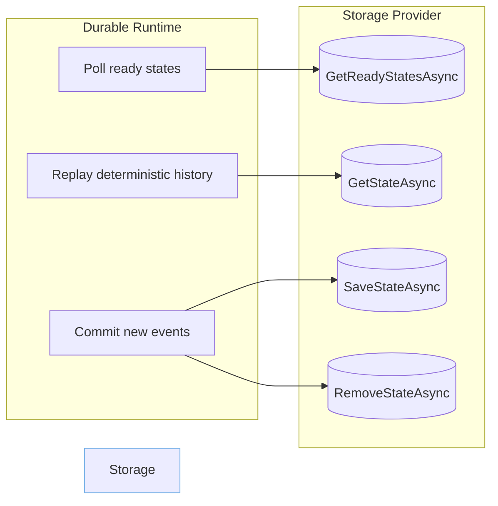
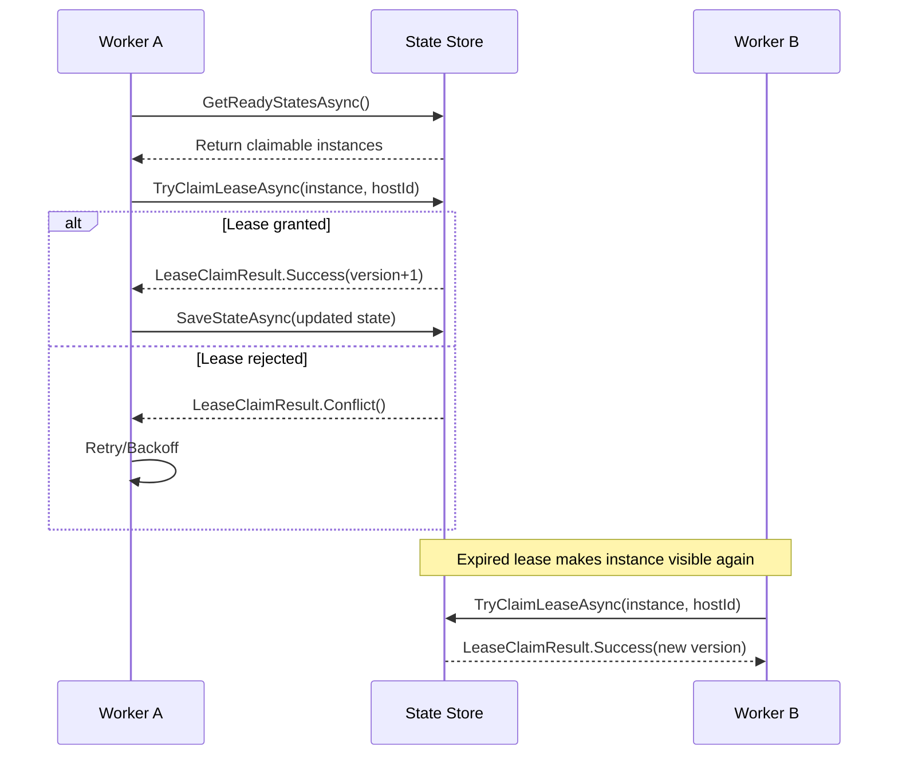
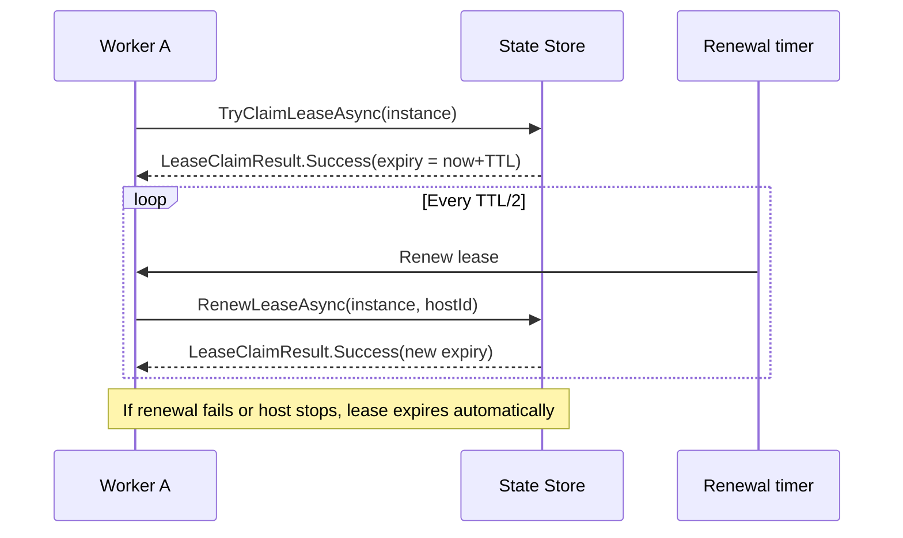

# Storage backends

Durable orchestrations need persistent state for the event history, timers, and orchestration metadata. A storage provider is the durable runtime's source of truth: it accepts deterministic decisions from the orchestrator, persists them, and feeds ready work back to the worker loop. The public repository includes ready-to-run examples for both SQLite and PostgreSQL, but you can also bring your own implementation.



## Provider responsibilities

Every storage backend implements the `IStateStore` contract exposed by `Asynkron.DurableFunctions`. At a minimum it must:

- Persist `DurableFunctionState` instances that contain the orchestration history, timers, and outstanding activities.
- Return states that are due for execution via `GetReadyStatesAsync` so the runtime can resume orchestrators on schedule.
- Support idempotent writes: orchestrator replays will retry the same `SaveStateAsync` payload until it succeeds.
- Delete terminal instances when `RemoveStateAsync` is called or when automatic cleanup is enabled.

### Writing a custom provider

1. **Implement `IStateStore`.** Provide concrete implementations for `SaveStateAsync`, `GetStateAsync`, `GetReadyStatesAsync`, and `RemoveStateAsync`. The methods should use transactions so partial updates do not leak through during process crashes.
2. **Register the provider.** Expose it through dependency injection so `DurableFunctionRuntime` can resolve it. In ASP.NET Core apps that usually means `services.AddSingleton<IStateStore, YourStore>();`.
3. **Handle serialization.** The runtime serializes orchestration payloads to JSON. Store them using UTF-8 text or a binary column that preserves the JSON value verbatim.
4. **Optimize ready-state queries.** Add indexes that support lookups by `ExecuteAfter`, `InstanceId`, and status flags so polling remains efficient under load.
5. **Add migrations.** Ensure the schema exists at startup. The built-in providers run migrations when the store is constructed; mirror that behavior if your backend requires table creation.

> Tip: start from the [`SqliteStateStore`](https://github.com/asynkron/Asynkron.DurableFunctions.Public/blob/main/src/Asynkron.DurableFunctions/Persistence/SqliteStateStore.cs) implementation to understand the minimal contract before layering on concurrency features.

### Supporting multi-host concurrency

When multiple workers share the same database you need optimistic concurrency in addition to the basic CRUD contract. Implement `IConcurrentStateStore`, which extends `IStateStore` with lease-aware operations, and host it with `ConcurrentDurableFunctionRuntime`.

Key responsibilities include:

- **Lease acquisition** via `TryClaimLeaseAsync` so only one host executes an instance at a time.
- **Lease renewal** for long-running orchestrations with `RenewLeaseAsync`.
- **Lease release** on completion or failure through `ReleaseLeaseAsync`.
- **Claimable state queries** that ignore instances whose leases are still valid.

The concurrent stores add `Version`, `LeaseOwner`, and `LeaseExpiresAt` columns to the `DurableFunctionStates` table and keep them in sync with each operation. Conflicts are expected: always retry when `TryClaimLeaseAsync` reports a version mismatch.

## Lease-based coordination

Leases guard against duplicate execution when multiple hosts poll the same backend. Each worker includes its unique host identifier when claiming a lease. The store atomically updates the row to include the owner, an expiry timestamp, and the next expected version. If the worker crashes or loses connectivity, the lease expires and another host can safely take over.



While an orchestration runs, the runtime renews the lease in the background to keep ownership alive.



When renewal fails due to a version conflict, the runtime stops processing the instance and lets another worker claim it after the expiry window.

## SQLite

Use SQLite when you need a self-contained database. The example runs entirely in-memory, but the same connection string works with file-backed databases as well.

```csharp title="SqliteExample.cs"
var connectionString = "Data Source=:memory:";
using var stateStore = new SqliteStateStore(connectionString, loggerFactory.CreateLogger<SqliteStateStore>());
var runtime = new DurableFunctionRuntime(stateStore, logger, loggerFactory: loggerFactory);
```

Recommendations:

- Enable `Cache=Shared;Journal Mode=WAL;` when multiple worker processes share the same `.db` file.
- Switch to `ConcurrentSqliteStateStore` for multi-host safety; it adds versioning columns and handles leases for you.
- Back up the `.db` file or use a network share if you need durability beyond the local disk.

## PostgreSQL

PostgreSQL is the preferred option when you deploy to Kubernetes or run several orchestrator hosts. The guide ships with a Docker Compose file that bootstraps PostgreSQL 16 and pgAdmin.

```bash
docker-compose up -d
```

Connect with the default credentials:

- Host: `localhost`
- Port: `5432`
- Database: `durablefunctions`
- Username: `durableuser`
- Password: `durablepass`

Wire it into your host using the extension methods.

```csharp title="PostgreSqlExample.cs"
builder.Services.AddDurableFunctionsWithPostgreSQL(connectionString, options =>
{
    options.PollingIntervalMs = 100;
    options.MaxConcurrentWorkflows = 10;
});
```

When the app starts, the provider ensures the schema exists. Concurrency-aware stores add `version`, `lease_owner`, and `lease_expires_at` columns plus the indexes they require.

## Schema hygiene

Both relational providers support automatic cleanup:

- Completed orchestrations are removed when `DurableOrchestrationOptions.AutoDeleteOnCompletion` is enabled.
- Use the HTTP management API `DELETE /runtime/orchestrations/{instanceId}` to purge on demand.
- Keep an eye on the `DurableFunctionStates` table size. If it grows beyond expectations, check for orchestrations that never complete or forget to release leases.
