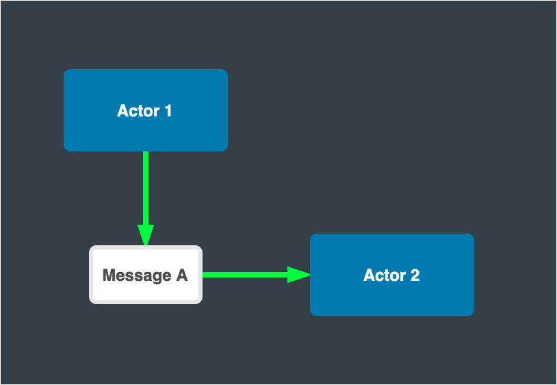
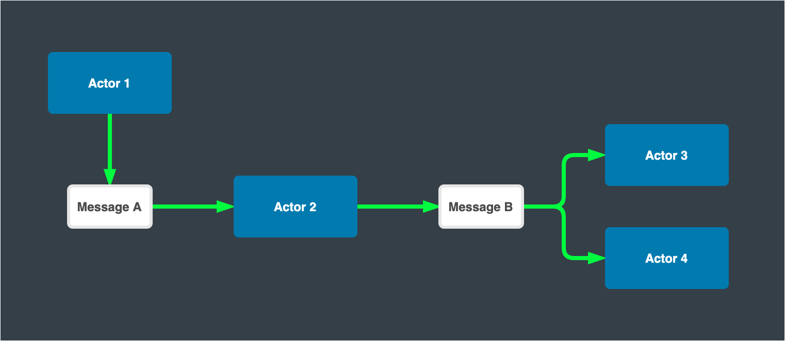

# Lesson 6: Actors and messages.

Before proceeding to a more detailed review of actors and messages, let's overview how these two concepts fit together.

We write the entire code of our system using actors. However, one actor alone cannot do much, so we communicate between actors using messages.

Here, Actor 1 creates an instance of a message of type A and passes it to Actor 2:

Actor 2 then performs some processing, creates a new message of type B, and sends this message to two actors, in this case, Actor 3 and Actor 4:

Note that sending a message from one actor to another is an asynchronous operation. Therefore, the actor can continue working once Actor 1 sends a type A message to Actor 2, meaning that Actor 1 does not have to wait for Actor 2 to finish processing the received message.

[Go ahead!](../lesson-7)
