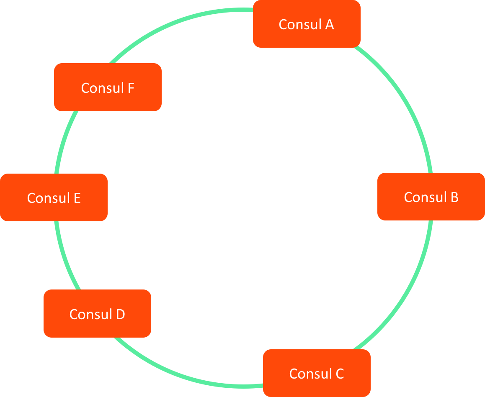
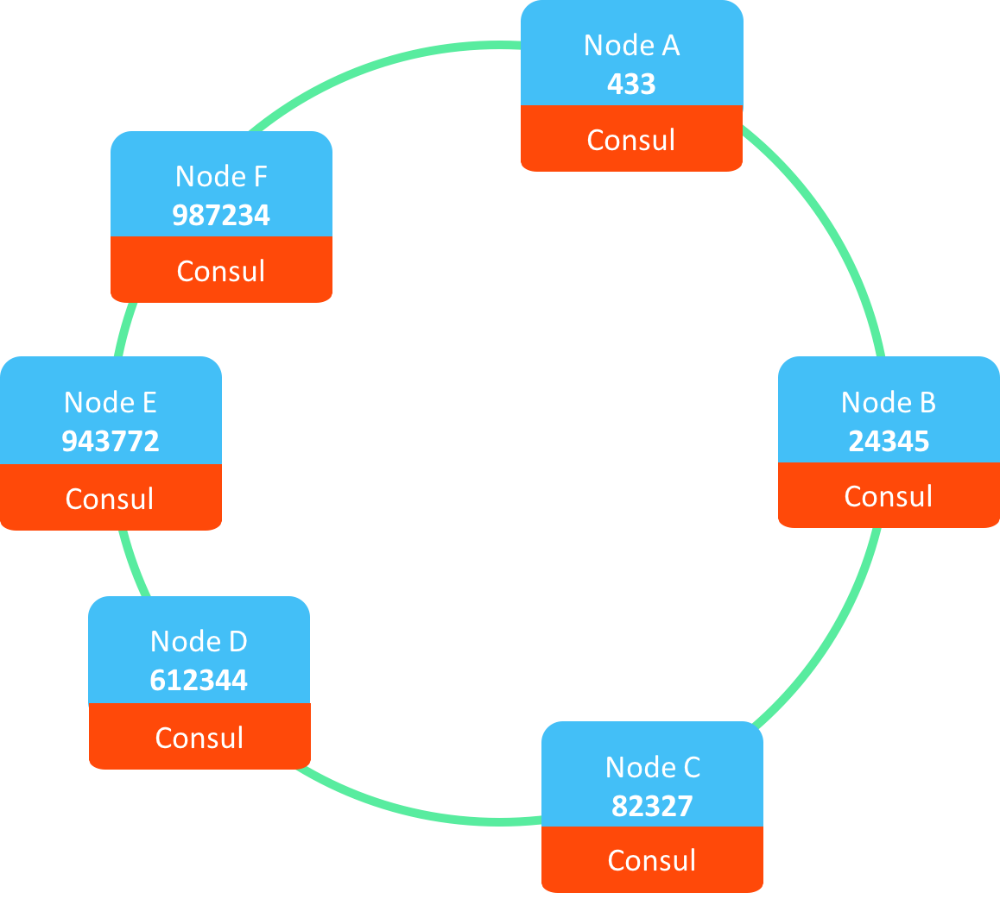
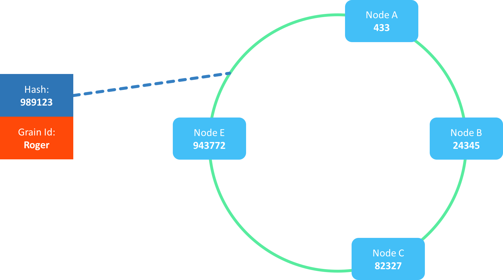
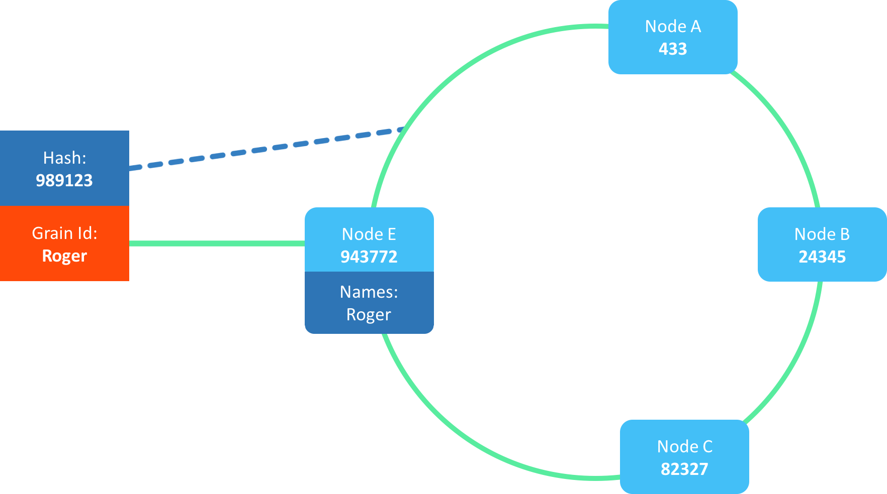
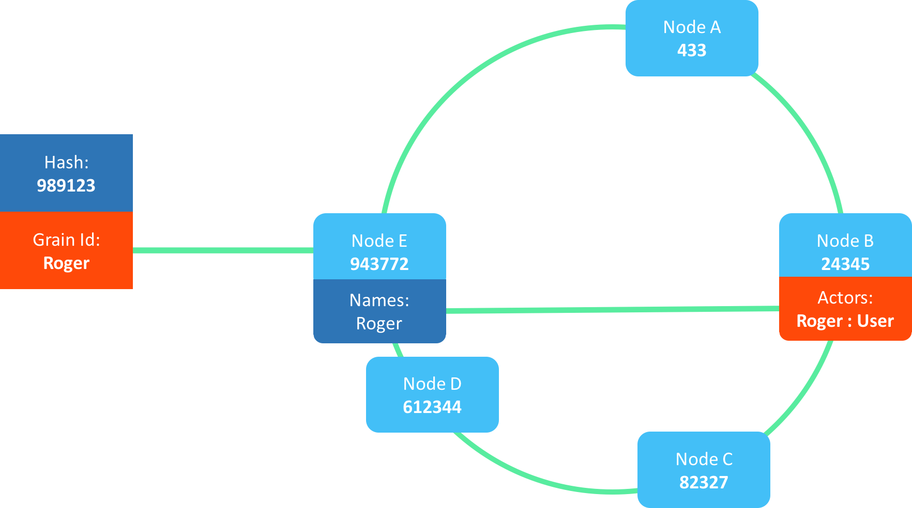
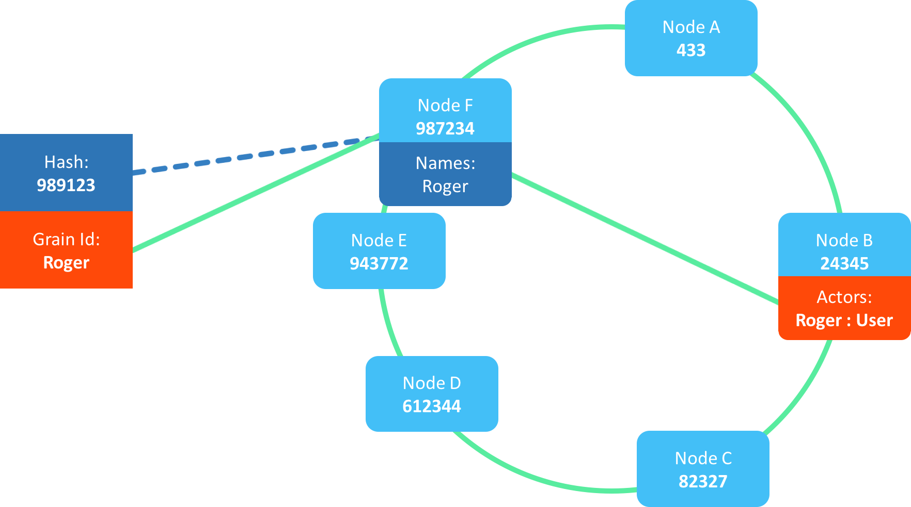
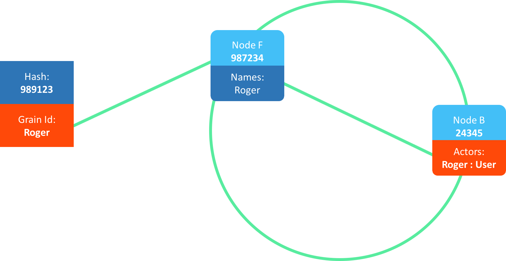

# Cluster Partitions

## Consul Cluster

Consul provides service discovery and health checking for the cluster.  
It monitors membership, handles node join and leave events, and maintains a consistent view of the cluster topology.

In this setup, Consul acts as the foundation on which the logical Proto.Cluster is built:

Key points:

* Consul maintains the authoritative list of live nodes.  
* Membership changes propagate quickly to Proto.Cluster.  
* Failure detection is delegated to Consul, simplifying the actor system layer.

## Proto Cluster

Proto.Actor builds a distributed virtual actor environment on top of the Consul controlled membership:

Each Proto.Cluster member registers itself using its host, port and unique id.  
These values feed into a hashing algorithm that determines how identities are distributed across the cluster.

Good to know:

* Proto.Cluster is transport agnostic, so the consistent hashing works regardless of underlying networking.  
* Cluster members do not need to know about each other's actors, only about cluster membership itself.  
* Actor activations are lazy, they happen only when a name is first invoked.

## Name to Member Affinity

Each member receives a hash produced from host, port and a unique identifier.  
These hashes form a **consistent hash ring**, described here:  
https://en.wikipedia.org/wiki/Consistent_hashing

Consistent hashing ensures that only a small portion of keys (actor names in this case) move when topology changes.

When invoking an actor named "Roger", the name hash might be 989123:

We locate this hash on the ring and pick the member immediately clockwise, which in this example is E:

Why this matters:

* Name ownership is stable when topology is stable.  
* Only a minimal set of names migrate when a node joins or leaves.  
* Actors are addressed through their names, not by direct node references.

## Actor Activations

Owning a name is not the same as hosting the actor.  
The name owner is responsible for routing and lookup, while the actor instance is activated via the placement strategy.

This results in the two step lookup:

1. Hash actor name to find the node that owns the identity.  
2. Let the owner activate or route to the node that will host the actor instance.

Why this separation exists:

* Actor lifetimes and state do not need to be moved when ownership changes.  
* Locality can be optimized by the placement strategy, independent of hash partitioning.  
* Workload distribution remains flexible while identity mapping remains stable.

Good to know:

* Placement strategies can consider load, affinity rules or custom logic.  
* The identity owner acts as a stable rendezvous point for all clients trying to reach the actor.

## Handling Topology Changes

Clusters are dynamic, so the hash ring will shift when nodes join, leave or fail.

When the ring shifts:

* Some identities move to another owner.  
* Actor instances usually remain where they are.  
* Only identity metadata is reassigned.

Benefits:

* Minimal disruption during scaling events.  
* Failures affect only a small subset of identities.  
* Running actors remain active and reachable through updated discovery.

Even in extreme cases, such as only two nodes left, the actor remains resolvable and operational:

Good to know:

* Consistent hashing guarantees O(log n) lookup and minimal churn.  
* Only nodes near the affected region of the ring experience change.  
* Actor callers never need to know where the actor physically lives.

## Multiple Activations

A known risk in this architecture is **multiple activations**, which occur when:

1. The name owning node crashes suddenly.  
2. Its existing activation becomes orphaned.  
3. A new owner is assigned the identity.  
4. A new activation starts elsewhere in the cluster.

This may result in two live actor instances:

* The orphan (unreachable by name).  
* The valid instance (reachable through new identity owner).

Consequences:

* Internal background activity in the orphan may cause data races.  
* External message routing is safe, since only one instance is addressable.  
* Systems that rely on strict single writer semantics may experience issues.

Mitigation strategies:

* Persist state in storage systems with CAS operations like Couchbase, DynamoDB or Etcd.  
* CAS mismatches surface write races between orphan and new instances.  
* Periodic tombstoning or activation heartbeats can also clean up orphans.

Good to know:

* Multiple activations are rare, usually tied to abrupt crashes rather than graceful leaves.  
* State persistence dramatically reduces the risk surface.  
* If determinism is critical, actors should be designed to assume they may be activated more than once.

