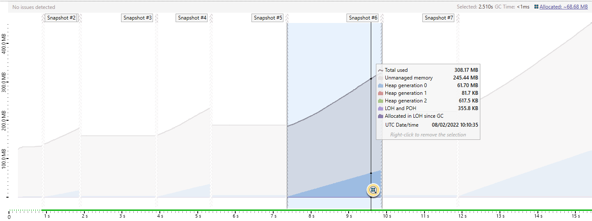
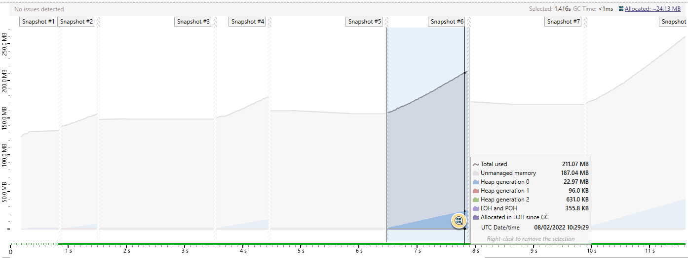
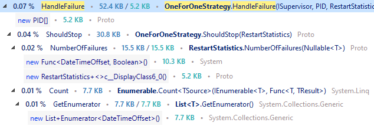

# Performance review by Dotnetos

In February 2022, The Dotnetos teams made a performance review of the Proto.Actor .NET core features.
This document contains the findings from this review.

Output of [Proto.Actor benchmarks](https://gist.github.com/rogeralsing/12d16983f9d2e27d7c4b39cd25a64b18), with full PGO on and off, to identify any visible quick wins with "measure first approach". It includes both dotMemory and dotTrace profiling. I've also made an initial code "look around".

## Spawn benchmark

It's mostly allocating 1GB of `ConcurrentQueueSegment` because `ConcurrentQueue` used underneath initialized by default with 32 such blocks, which is then multiplied 1M times (per every actor).

That's a little surprising consequence of using `ConcurrentQueue` but for 1M it's probably ok!

There are little suboptimal allocations like below but I'm not sure if it is worth to remove them (one is from the benchmark itself):


## In process benchmark

Because of more complex nature of benchmarking program (preparations and cleanup) I've added dotMemory profiling API control:

- `MemoryProfiler.CollectAllocations(true);` at the beginning of the program
- `MemoryProfiler.GetSnapshot` before and after the area of interest:

  ```cs
   MemoryProfiler.GetSnapshot($"Before {t}/{clientCount}");
   for (var i = 0; i < clientCount; i++)
   {
       var client = pingActor[i];
       var echo = pongActor[i];

       context.Send(client, new Start(echo));
   }

   await Task.WhenAll(tasks);
   MemoryProfiler.GetSnapshot($"After {t}/{clientCount}");
  ```

Initial rundown shows allocations during the message processing, here's an 16/50 activity marked:



Which is allocating ~68MB where 2/3 is a `WaitCallback` allocated in `DefaultMailbox.Schedule`:


because of:

```cs
ThreadPool.UnsafeQueueUserWorkItem(_ => RunAsync(),null);
```

We can easily improve it by using static delegate:

```cs
ThreadPool.UnsafeQueueUserWorkItem(static x => RunAsync(x), this, false);
```

which obviously requires a little changes in `RunAsync` but they do not propagate outside:

```cs
private static Task RunAsync(DefaultMailbox mailbox)
{
   var task = mailbox.ProcessMessages();
   if (!task.IsCompletedSuccessfully)
   {
       return Await(mailbox, task);
   }
   Interlocked.Exchange(ref mailbox._status, MailboxStatus.Idle);
   ...
```

This indeed allows to get rid of `WaitCallback` so now the same benchmark allocates ~24MB:




:::note
This issue has been corrected after the review
:::

There is also one funny method `OneForOneStrategy.ShouldStop` producing a little of unwanted garbage:



which is one of those examples when plain old loop instead of LINQ pays off:

```cs
public int NumberOfFailures(TimeSpan? within)
{
   if (!within.HasValue)
       return _failureTimes.Count;
   int result = 0;
   foreach (var failureTime in _failureTimes)
       if (DateTimeOffset.UtcNow - failureTime < within)
           result++;
   return result;
}
```

:::note
This issue has been corrected after the review
:::

Additionally, a few trivial things:

- `NullReferenceException` thrown 150 times from `ActorContext.SendUserMessage`? 
- I'd consider moving to [Compile-time logging source generation](https://docs.microsoft.com/en-us/dotnet/core/extensions/logger-message-generator) or [string interpolation](https://devblogs.microsoft.com/dotnet/string-interpolation-in-c-10-and-net-6/), for example in `Proto.OneForOneStrategy.HandleFailure.LogInfo`

## Remote benchmark

First of all, the previous fix allows to avoid hundreds of MBs of `WaitCallback` allocations that come from `RemoteMessageHandler.HandleRemoteMessage`.

:::note
This issue has been corrected after the review
:::

Besides that, much more data is allocated because of materializing `MessageEnvelope`, to the extent when looking at anything else does not make sense:


The only thought I have in such scenario is - is it possible to get rid of `object`/`class` in some paths (like sending) and use `ref struct` instead? I've skimmed through code and it obviously require much work. I'm not able to propose anything for now here... But well, I have a feeling it won't be ever possible because of Protobuf and the whole architecture.

## Cluster benchmark

It would be nice to get rid of those state machine allocations here:


that come from `ExperimentalClusterContext.RequestAsync`:

```cs
await Task.WhenAny(task, _clock.CurrentBucket);
```

And could be maybe optimized with a new .NET 6 API as described in [Performance Improvements in .NET 6](https://devblogs.microsoft.com/dotnet/performance-improvements-in-net-6/) after a little of `TaskClock` redesign:

Beyond these new builders, there have been other new APIs introduced in .NET 6 related to tasks. `Task.WaitAsync` was introduced in `dotnet/runtime#48842` and provides an optimized implementation for creating a new `Task` that will complete when either the previous one completes.
