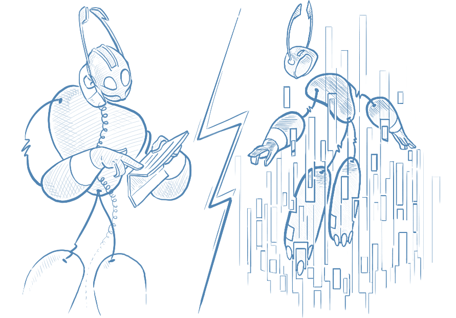

# Remote Spawn



Remote Spawning means the act of `Spawn`-ing an actor on another host/member in a distributed setting.
(For more information about Spawning, see [Spawn](spawn.md))

In Proto.Actor you can do this using both the **Proto.Remote**, and the **Proto.Cluster** modules.
The way to do it are basically the same, with some small differences.

To register what kinds of actors can be spawned remote or in a cluster, you register the actor types, or "kinds" as they are called here to not conflate with other terminology.

This is done on either the on the C#-`RemoteConfig` / Go-`remote.Config` object using `WithRemoteKind(name,props)`.

Or, on the C#-`ClusterConfig`/ Go-`cluster.Config` objects using `WithClusterKind(name, props)`.

This is essentially a dictionary mapping from string, the Kind, to a `Props` which tells the remote and cluster modules how to configure and spawn an actor of that "kind".

## Remote Spawn using Proto.Remote

### Registration

#### .NET


```csharp
var config = GrpcCoreRemoteConfig
    .BindTo(advertisedHost, 12000)
    .WithProtoMessages(MyMessagesReflection.Descriptor)
    .WithRemoteKind("echo", Props.FromProducer(() => new EchoActor()));
```


#### Go


```go
var config = remote.Configure(advertisedHost, 12000)
    .WithRemoteKind("echo", actor.FromProducer(someProducer));
```


### Client Usage

#### .NET


```csharp
var result = await system.Remote().SpawnNamedAsync("remoteaddress", "actor name", "actor kind", timeout);
var pid = result.Pid;
```


#### Go


```go
pid := remoter.Spawn("remoteaddress", "actor name", "actor kind")
```


## Remote Spawn using Proto.Cluster

### Registration

#### .NET


```csharp
var config = ClusterConfig.Setup(....)
    .WithClusterKind("echo", Props.FromProducer(() => new EchoActor()));
```


#### Go


```go
var config = cluster.Configure(...)
    .WithClusterKind("echo", actor.FromProducer(someProducer));
```


### Client Usage

Note how we are not touching any `PID` here, instead all the resolution of virtual actors is hidden from the developer behind the cluster API.

#### .NET


```csharp
var res = cluster.RequestAsync("MyActor","MyKind", msg, CancellationTokens.WithTimeout(2000));
```


#### Go


```go
res := cluster.Call("MyActor","MyKind", msg)
```


## Why the separation of the two?

If Proto.Remote and Proto.Cluster configure remote spawning the same way, why separate the two?

Conceptually, they work the same, but from an implementation point of view they do not.
Cluster actors have different lifecycles, different hosting and different internal plugins and messages.
For this reason we chose to keep them separate, yet similar from an API perspective.

A completely valid scenario might be that you want to spawn an actor on a very specific node, and it should work just like any other actor, then you can do this using Proto.Remote.

While if you in the same application, also want to leverage virtual actors, with the rich set of features they provide, you would do this using Proto.Cluster.

## How does this compare to Erlang or Akka?

Proto.Actor has chosen a far less complex approach for remote spawning, or "remote deploy" as it is called in the Akka world.

Erlang has its own VM, and is capable of passing entire programs over the wire to other nodes in order to spawn processes remotely.

Akka allows the developer to pass `Props` over the wire and spawn actors remotely that way.

Conceptually these approaches are interesting and flexible.

The downside however is that this requires a fair amount of dark magic to work in an environment such as the JVM/.NET or Go.
You need to have a serializer that is capable of serializing entire objects graphs of arbitrary objects. objects that in many times are not to be considered "messages" and designed for serialization.
Objects that may or may not be safe to deserialize on the other end.

More on this topic here [Harmful Magic Serializers](serialization#harmful-magic-serializers)

Proto.Actor aims to be closer to the microservice world, each node announces to the `ClusterProvider` what kind of actors it is capable of spawning using service discovery.

There is no way for a remote node to spawn or even pass anything unexpected on another node.
