# Asynkron Documentation Platform

**Status: Greenfield target architecture.** This document describes a desired
future documentation platform, not the system currently running in production.
It is intended for technical leaders and documentation contributors deciding
where future capabilities belong.

## Current facts and target assumptions

The current repository is a Docusaurus documentation site. It contains product
documentation for Proto.Actor, Durable Functions, OcppServer, Faktorial,
BokaBra, and Inmem / Matcha. Its checked-in configuration enables Mermaid,
Algolia search, and strict broken-link handling. This page is internal working
material outside Docusaurus's configured `./docs/products` publication root;
it is not part of the published documentation site.

Everything else below is an aspiration. In particular, the ingestion pipeline,
knowledge graph, governance services, publishing control plane, analytics, and
personalization are proposed capabilities. Product names identify content
domains inside the platform; they do not imply separate platform deployments.

## Goals and target qualities

The platform turns product knowledge into trustworthy, searchable, versioned
documentation and uses reader outcomes to improve that knowledge. Its target
qualities are:

- **Trust:** owned, reviewed content with visible provenance.
- **Freshness:** measurable lifecycle policies and actionable stale-content signals.
- **Traceability:** a change can be followed from source through review to artifact.
- **Accessibility:** inclusive, responsive experiences and automated checks.
- **Portability:** web, machine-consumable, and offline outputs from one knowledge core.
- **Safe delivery:** previews, immutable releases, controlled rollback, and recoverable data.
- **Privacy:** feedback and analytics collect the minimum information needed.

## System context

Readers seek an answer through the documentation experience. Contributors and
product teams supply knowledge and approve changes. The platform consumes
product sources and uses external identity and delivery services to publish
approved artifacts. Privacy-aware outcome signals return to contributors.

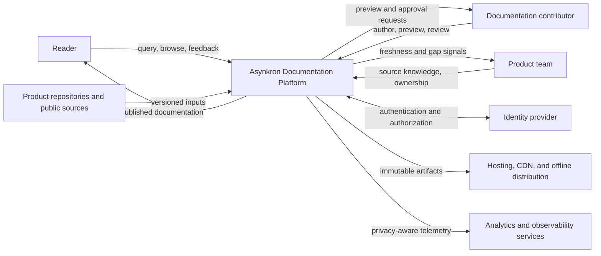

| Context element | Responsibility and relationship |
| --- | --- |
| Reader | Sends queries, navigation choices, and optional feedback; receives accessible published answers. |
| Documentation contributor | Authors and reviews content, inspects previews, and responds to quality signals. |
| Product team | Owns source knowledge and content domains; receives gaps and freshness work. |
| Product repositories and public sources | Supply versioned facts to the content pipeline. |
| Identity provider | Establishes contributor identity and authorization for protected workflows. |
| Hosting, CDN, and offline distribution | Delivers immutable approved outputs to readers. |
| Analytics and observability services | Receive minimized operational and outcome telemetry. |
| Asynkron Documentation Platform | Governs the complete path from knowledge intake to delivery and improvement. |

## Module topology

Seven modules divide the target platform. Content moves clockwise from supply
through governance and publishing; reader behavior closes the loop through
feedback. Platform Foundations supplies shared controls to every module.

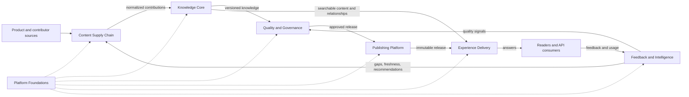

| Module | Responsibility | Primary incoming relationship | Primary outgoing relationship |
| --- | --- | --- | --- |
| Content Supply Chain | Acquires, normalizes, and prepares authorable contributions. | Product sources and contributor edits. | Normalized contributions to the Knowledge Core. |
| Knowledge Core | Stores versioned content, relationships, assets, and examples. | Normalized contributions. | Governed knowledge to Quality and Experience Delivery. |
| Quality and Governance | Applies ownership, policy, validation, lifecycle, and approval. | Versioned knowledge and intelligence signals. | Approved releases to Publishing; findings to contributors. |
| Experience Delivery | Helps people and machines discover the right versioned answer. | Published artifacts and searchable knowledge. | Answers to readers; outcome events to Feedback and Intelligence. |
| Publishing Platform | Builds, promotes, delivers, and rolls back immutable releases. | Approved release candidates. | Deployed artifacts and release state to Experience Delivery. |
| Feedback and Intelligence | Converts minimized outcome data into prioritized improvements. | Reader feedback, search behavior, and freshness signals. | Recommendations and work signals to Supply and Governance. |
| Platform Foundations | Provides identity, configuration, observability, audit, and recovery. | Policies and operational state from all modules. | Shared controls and operational services to all modules. |

## Module boundary contracts

The module seams below define authority and failure containment without choosing
a transport, schema, service boundary, or deployment topology. Durable domain
records are the authoritative state a module owns. Projections can be rebuilt
from those records, while advisory signals must return through the normal
contribution and approval path before they can change published knowledge.

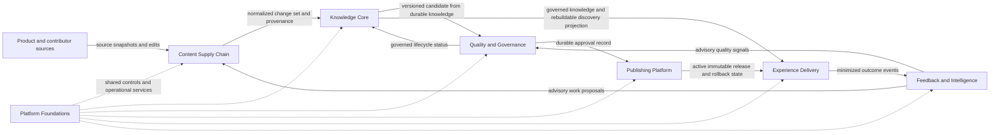

| Module | Authoritative record | Accepted inputs | Emitted outputs | Failure and ownership boundary |
| --- | --- | --- | --- | --- |
| Content Supply Chain | Accepted source snapshots, normalized change sets, and contribution provenance until the Knowledge Core accepts them. | Versioned product sources, public facts, contributor edits, templates, and advisory work proposals. | Normalized change sets with product, version, ownership, and provenance metadata. | Intake or normalization failure leaves the Knowledge Core unchanged; Supply cannot approve content or write around the Core's acceptance boundary. |
| Knowledge Core | Versioned content, taxonomy, relationships, assets, examples, and their provenance. | Normalized change sets accepted from Supply and governed lifecycle updates. | Versioned candidates for Governance plus knowledge and rebuildable discovery projections for Experience. | A failed write cannot expose partial knowledge; indexes and other projections may be rebuilt, but no projection becomes a competing source of truth. |
| Quality and Governance | Ownership, policy, validation evidence, lifecycle state, and approval decision records. | Versioned candidates from the Core, review decisions, validation findings, and advisory intelligence signals. | Approved release candidates with evidence, or actionable findings routed back to contributors. | Governance alone approves; missing evidence or unavailable review blocks approval, and neither Publishing nor Feedback may infer it. |
| Publishing Platform | Immutable release artifacts and manifests, the active-release pointer, and rollback history. | Governance-approved release candidates and release-health evidence. | Preview or deployed artifacts, active release state, and rollback outcomes for Experience and Governance. | Publishing alone activates a release; build or health failure preserves the last healthy pointer and rollback never mutates an artifact in place. |
| Experience Delivery | No durable knowledge or approval record; navigation, search indexes, caches, and rendered outputs are rebuildable projections. | Active immutable releases, governed knowledge and discovery projections, explicit version choices, and reader context. | Accessible answers, machine and offline outputs, and minimized outcome events. | Delivery failure cannot mutate upstream knowledge or release authority; the experience degrades independently and remains usable without analytics. |
| Feedback and Intelligence | Minimized feedback, aggregate outcome measures, and explained recommendation records. | Voluntary reader feedback, minimized outcome events, search-gap measures, freshness signals, and release outcomes. | Advisory recommendations and reviewable work proposals routed to Supply and Governance. | Intelligence may prioritize and explain but never silently changes content, grants approval, or controls a release; its failure does not interrupt published documentation. |
| Platform Foundations | Shared identity, permission, configuration, audit, observability, backup, and recovery records; no domain record or domain decision. | Module policies, protected configuration, audit events, health signals, and recovery requirements. | Least-privilege controls, operational telemetry, audit evidence, and recovery services for every module. | Foundations contains platform failures and restores capability but cannot take content, approval, or release authority; each module remains accountable for applying its controls. |

## Content Supply Chain

The supply chain accepts both automated and human contributions, converts them
to a common content model, and gives contributors a consistent workspace.

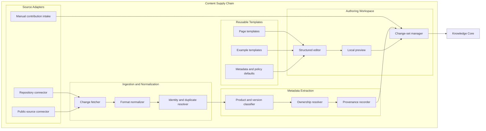

| Component | Subcomponents | Responsibility and relationships |
| --- | --- | --- |
| Source Adapters | Repository connector; Public-source connector; Manual contribution intake | Pulls product changes and public facts or accepts a contributor submission, then hands input to ingestion or the authoring workspace. |
| Ingestion and Normalization | Change fetcher; Format normalizer; Identity and duplicate resolver | Fetches changed material, converts it to the common model, and reconciles duplicate identities before metadata extraction. |
| Metadata Extraction | Product and version classifier; Ownership resolver; Provenance recorder | Assigns content domain and version, resolves accountable owners, and records source evidence for the change set. |
| Authoring Workspace | Structured editor; Local preview; Change-set manager | Applies edits, renders contributor feedback, and packages normalized content for the Knowledge Core. |
| Reusable Templates | Page templates; Example templates; Metadata and policy defaults | Supplies repeatable structures and defaults to the structured editor. |

## Knowledge Core

The Knowledge Core is the source of truth for documentation knowledge. The
product taxonomy covers Proto.Actor, Durable Functions, OcppServer, Faktorial,
BokaBra, and Inmem / Matcha without coupling storage to a product-specific site.

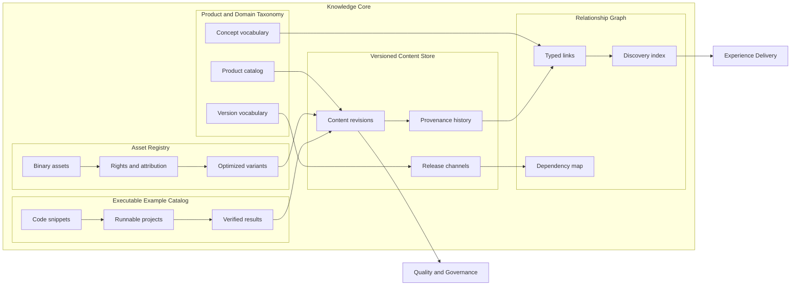

| Component | Subcomponents | Responsibility and relationships |
| --- | --- | --- |
| Product and Domain Taxonomy | Product catalog; Version vocabulary; Concept vocabulary | Gives incoming content stable product, version, and concept identities used by storage and relationships. |
| Versioned Content Store | Content revisions; Release channels; Provenance history | Preserves content changes, promotion channels, and source lineage; supplies candidates to governance. |
| Relationship Graph | Typed links; Dependency map; Discovery index | Connects related knowledge, exposes impact relationships, and feeds discovery to Experience Delivery. |
| Asset Registry | Binary assets; Rights and attribution; Optimized variants | Stores media with usage evidence and produces delivery-ready variants attached to content revisions. |
| Executable Example Catalog | Code snippets; Runnable projects; Verified results | Links examples to runnable contexts and records validated outcomes alongside the relevant revision. |

## Quality and Governance

Governance makes trust explicit: every candidate has an owner, passes declared
policies, and receives an auditable approval or a concrete finding.

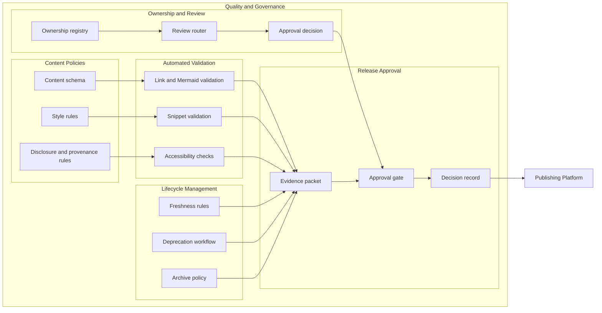

| Component | Subcomponents | Responsibility and relationships |
| --- | --- | --- |
| Ownership and Review | Ownership registry; Review router; Approval decision | Resolves accountable reviewers, routes candidates, and contributes a human decision to the release gate. |
| Content Policies | Content schema; Style rules; Disclosure and provenance rules | Defines the structural, editorial, and traceability expectations consumed by automated validation. |
| Automated Validation | Link and Mermaid validation; Snippet validation; Accessibility checks | Checks navigability, diagrams, examples, and inclusive presentation; emits findings or evidence. |
| Lifecycle Management | Freshness rules; Deprecation workflow; Archive policy | Turns age and product status into review, deprecation, or archive actions and release evidence. |
| Release Approval | Evidence packet; Approval gate; Decision record | Combines validation and review, records the outcome, and sends only approved releases to Publishing. |

## Experience Delivery

Experience Delivery converts published, indexed knowledge into accessible
answers for readers, tools, and offline consumers.

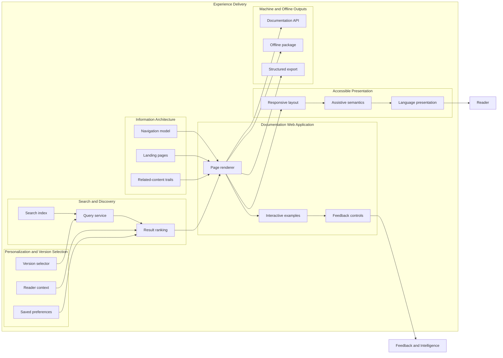

| Component | Subcomponents | Responsibility and relationships |
| --- | --- | --- |
| Documentation Web Application | Page renderer; Interactive examples; Feedback controls | Renders selected knowledge, hosts safe interactions, and sends explicit reader feedback to intelligence. |
| Information Architecture | Navigation model; Landing pages; Related-content trails | Organizes entry points and journeys consumed by the page renderer. |
| Search and Discovery | Search index; Query service; Result ranking | Resolves a query against indexed knowledge and ranks answers using declared context. |
| Personalization and Version Selection | Version selector; Reader context; Saved preferences | Selects compatible documentation without hiding the active version or overriding reader intent. |
| Accessible Presentation | Responsive layout; Assistive semantics; Language presentation | Adapts rendered pages for devices, assistive technology, and supported languages before delivery. |
| Machine and Offline Outputs | Documentation API; Offline package; Structured export | Publishes the same governed knowledge for tools, disconnected readers, and downstream processing. |

## Publishing Platform

Publishing separates preview from release, promotes immutable artifacts, and
makes rollback a normal operation rather than an emergency rebuild.

```mermaid
flowchart LR
    subgraph PP[Publishing Platform]
        subgraph PE[Preview Environments]
            Ephemeral[Ephemeral preview]
            Diff[Visual and content diff]
            ReviewURL[Review URL manager]
        end
        subgraph BO[Build Orchestration]
            Queue[Build queue]
            Builder[Deterministic builder]
            Manifest[Release manifest]
        end
        subgraph IS[Immutable Artifact Store]
            Bundle[Site bundle]
            Metadata[Artifact metadata]
            Retention[Retention manager]
        end
        subgraph DC[Deployment and CDN]
            Promote[Environment promotion]
            Edge[Edge distribution]
            Health[Release health check]
        end
        subgraph CR[Cache and Rollback]
            Invalidate[Cache invalidation]
            Pointer[Active-release pointer]
            Restore[Rollback controller]
        end
    end
    Ephemeral --> Diff --> ReviewURL
    ReviewURL --> Queue --> Builder --> Manifest
    Builder --> Bundle --> Metadata --> Retention
    Manifest --> Promote
    Metadata --> Promote --> Edge --> Health
    Health --> Invalidate
    Invalidate --> Pointer
    Health -->|failed| Restore --> Pointer
    Pointer --> ExperienceOut[Experience Delivery]
```

| Component | Subcomponents | Responsibility and relationships |
| --- | --- | --- |
| Preview Environments | Ephemeral preview; Visual and content diff; Review URL manager | Creates isolated candidate views, explains changes, and gives reviewers a stable preview link. |
| Build Orchestration | Build queue; Deterministic builder; Release manifest | Schedules approved candidates, produces reproducible outputs, and declares release contents. |
| Immutable Artifact Store | Site bundle; Artifact metadata; Retention manager | Preserves release bundles and their metadata long enough to audit or restore them. |
| Deployment and CDN | Environment promotion; Edge distribution; Release health check | Promotes an artifact, distributes it, and verifies release health before activation. |
| Cache and Rollback | Cache invalidation; Active-release pointer; Rollback controller | Switches readers to a healthy release, refreshes caches, or restores a retained artifact. |

## Feedback and Intelligence

This module turns deliberately minimized reader and platform signals into
explainable recommendations. It never makes an unreviewed content change.

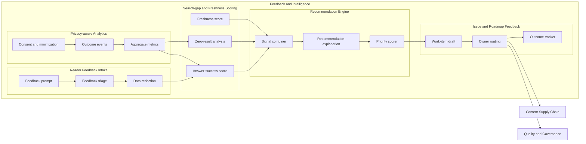

| Component | Subcomponents | Responsibility and relationships |
| --- | --- | --- |
| Privacy-aware Analytics | Consent and minimization; Outcome events; Aggregate metrics | Applies collection constraints, records useful outcomes, and exposes only appropriate aggregates to scoring. |
| Reader Feedback Intake | Feedback prompt; Feedback triage; Data redaction | Accepts voluntary feedback, classifies it, and removes unnecessary personal data before analysis. |
| Search-gap and Freshness Scoring | Zero-result analysis; Answer-success score; Freshness score | Measures missing answers, answer usefulness, and lifecycle risk for the recommendation engine. |
| Recommendation Engine | Signal combiner; Recommendation explanation; Priority scorer | Combines scores, explains why action is proposed, and ranks bounded improvement opportunities. |
| Issue and Roadmap Feedback | Work-item draft; Owner routing; Outcome tracker | Creates reviewable work proposals, routes them to owners, and tracks whether the resulting change helped. |

## Platform Foundations

Foundations is a shared control plane, not a bypass around module ownership. It
provides the security and operational capabilities every other module consumes.

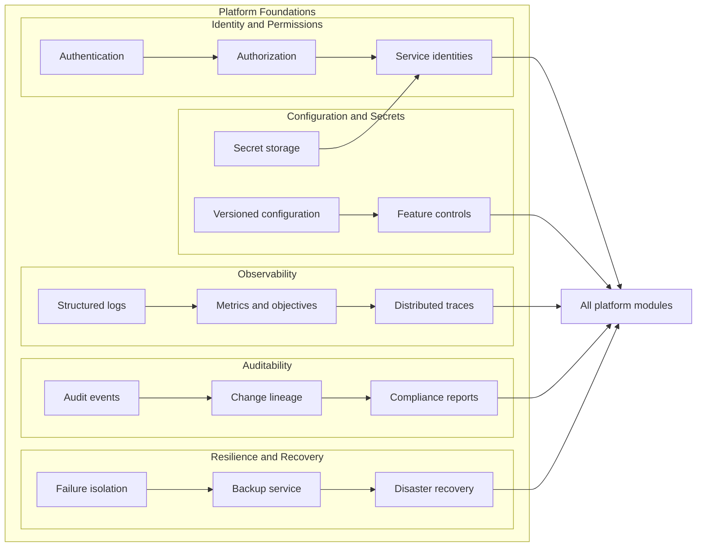

| Component | Subcomponents | Responsibility and relationships |
| --- | --- | --- |
| Identity and Permissions | Authentication; Authorization; Service identities | Establishes people and workloads, then supplies least-privilege decisions to every module. |
| Configuration and Secrets | Versioned configuration; Secret storage; Feature controls | Delivers reviewable settings, protected credentials, and controlled rollout switches to modules. |
| Observability | Structured logs; Metrics and objectives; Distributed traces | Correlates module behavior and exposes health and service-level outcomes. |
| Auditability | Audit events; Change lineage; Compliance reports | Records sensitive actions, joins them to content and release lineage, and produces reviewable reports. |
| Resilience and Recovery | Failure isolation; Backup service; Disaster recovery | Contains faults, protects durable data, and restores platform capability after a major failure. |

## End-to-end flows

### Contribution to publication

A product or contributor change is normalized, versioned, validated, approved,
built into an immutable artifact, and promoted. Findings return to the author;
only the approved path reaches readers.

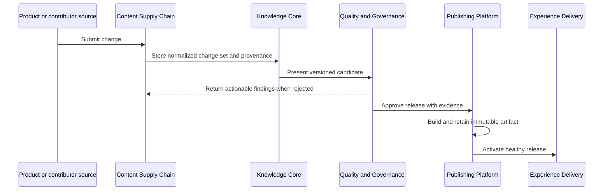

### Reader query to answer

Experience Delivery combines an explicit version and reader context with the
Knowledge Core's discovery index, renders the governed answer, and emits only
minimized outcome telemetry.

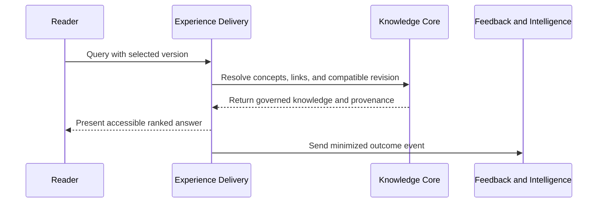

### Feedback to content improvement

Reader feedback and aggregate search outcomes are redacted and scored. The
result is an explained, owner-routed proposal; a contributor still decides and
uses the normal supply and governance path to change content.

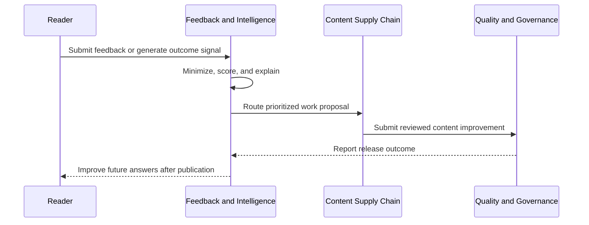

### Preview and approval to deploy or rollback

Reviewers inspect an isolated preview and evidence packet. Publishing promotes
the approved artifact, checks health, and moves the active pointer forward or
back without rebuilding an older release.

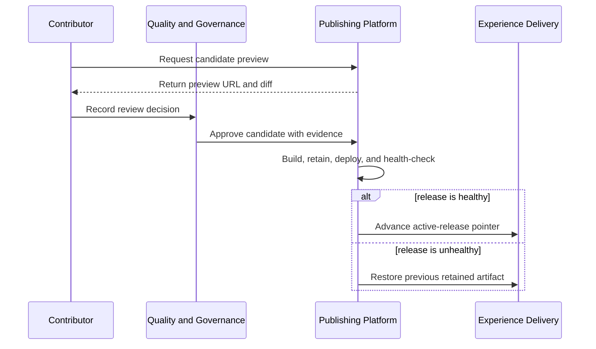

## Architectural boundaries

- Content-domain ownership belongs in the taxonomy and governance model, not in
  separate copies of the delivery platform.
- The Knowledge Core holds durable knowledge; search indexes, previews, and CDN
  caches are rebuildable projections.
- Quality and Governance owns approval. Neither Publishing nor Feedback and
  Intelligence may silently approve or rewrite content.
- Publishing promotes immutable artifacts and changes a release pointer; it
  does not mutate a deployed release in place.
- Platform Foundations provides shared controls while each module remains
  accountable for applying them.
- Reader telemetry is optional and minimized. Documentation remains usable when
  analytics or recommendation processing is unavailable.

## How to use this dream

Future work should name the target module and component it advances, state what
current repository fact it starts from, identify the authoritative record and
handoff it affects, and preserve the contracts and boundaries above. This dream
intentionally does not choose vendors, deployment topology, or a delivery
roadmap. Those decisions require evidence and owner review when an
implementation is proposed.
